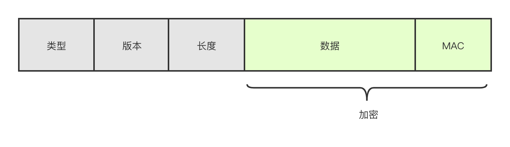

## HTTPS

**HTTPS 为什么安全？**

网络安全一般分为: 报文机密性，报文完整性，端系统鉴别，运行安全

1. HTTPS 传输加密: HTTPS 传输时使用对称加密，加密的数据无秘钥即使获取也无意义（机密性）
2. HTTPS Hash 算法: HTTPS 传输数据时，会带上数据的 Hash 值，保证数据的正确传输，不被串改（报文完整性）
3. HTTPS 证书: 保证端系统身份明确，无法被中间人攻击（断电鉴别）

### SSL/TLS

**SSL（安全套接字层）**: 由 Netscape 公司研发的一项技术标准，用于保证两个应用程序之间保证两个通信程序之间的数据完整性和机密性。目前存在 SSL1.0、SSL2.0、SSL3.0（默认，前两个标准已经不使用）

在 HTTPS 中，SSL 位于 HTTP 和 TCP 中插入 SSL 层，传输给 TCP 的数据被 SSL 加密，HTTP => SSL => TCP，在 OSI 7 层模型中位于表现层。

- SSL 握手协议
- SSL 记录协议

**TLS（传输层安全）**: 在 SSL3.0 时，IETF 在 SSL3.0 基础上，添加了少数机制，并重新命名为 TLS1.0，用于更安全的保证两个通信程序之间的数据完整性和机密性、目前存在 TLS1.0（默认）、TLS1.1、TLS1.2

- TLS 握手协议
- TLS 握手协议

**SSL 和 TSL 区别**:

1. 是否标准化: TLS 是 IETF 标准化后的协议，SSL 是 Netscape 研发的协议
2. TLS1.0 可以看做 SSL3.1，在 SSL 基础上更新 **更安全的 MAC 算法、更严密的警报、规范更明确**

#### SSL 握手

1. 客户端: 发送 1. 协议版本；2. 支持加密方式；3.支持压缩方式；4. 秘钥 Key1 = Client random
2. 服务端: 发送 1. 确定协议版本；2. 所选加密方式；3. 所选压缩方式；4. 证书；5. 秘钥 Key2 = Server random
3. 客户端: 1. 检验证书（检验证书颁发机构、是否合法、是否过期、是否是当前访问域名...）; 2. 证书检验通过后，生成 Key3 = Premaster secret，并使用证书公钥加密后，传输给服务端
4. 服务端: 接收 Key3，并使用私钥解密，并使用 Session Key = calculate(Key1+Key2+Key3) 作为秘钥，加密后续所有会话

tips: Session Key 是有上述所选择的加密方式生成的，一般为 AES 算法: Session Key = AES(Key1 + Key2 + Key3);

#### SSL 记录



图片自《计算机网络 自顶向下方法》内容绘画

## 安全

**安全是建立在信任的基础上，如果信任不存在了，即使做再多防御也无意义**

### 特点

1. 机密性: 保证报文不被窃取，或即使被窃取也无法获取有用的信息
2. 完整性: 保证报文完整，不被篡改或删除
3. 可用性：保证服务可用（DOS 攻击就是使服务不可用）

#### 实现

1. 白名单、黑名单
2. 最小权限原则: 授予主体必要的权限，其余皆不授予
3. 纵深布防: 不同层面的防御；正对性实施防御
4. **数据和代码分离**: 解决由**注入**引发的安全问题
5. 不可预测性: 让结果不可预测。譬如 MySQL 的自增 ID，很容易预测

### 浏览器安全

#### 同源策略

同源策略: 限制不同源的脚本，对当前 Document 获取、设置某些属性。主要分为三个关键点 **同 IP、同端口、同协议**。主要表现为如下三点

1. 限制对 cookie，localStorage，sessionStorage 读取
2. 限制对 DOM 操作
3. 限制 Ajax 请求，对于 Ajax 来说，**同源策略是限制了 Javascript 权限，使其不能读取 Ajax 响应，而不是无法发出请求**

在浏览器中，img、src、script、iframe、link 等标签可以加载非同源文件，不受同源策略限制，**只能加载资源，但不能读写资源的内容**

## LeetCode

### 圆圈中最后剩下的数字

思路: 递归，公式推导: f(n, m) = (f(n-1, m) + m) % n-1

```typescript
function lastRemaining(n: number, m: number): number {
  if (n === 1) return 0;
  return (lastRemaining(n - 1, m) + m) % n;
}
```

**注意**

1. 数字从 0 开始

[圆圈中最后剩下的数字](https://leetcode-cn.com/problems/longest-palindrome/https://leetcode-cn.com/problems/yuan-quan-zhong-zui-hou-sheng-xia-de-shu-zi-lcof/)

### 生命游戏

思路:

1. 每个细胞需要与周围 8 个细胞作对比，根据对比结果判断细胞存活
2. 由于细胞状态可能出现变更，则无法简单的使用 0,1 来表示，额外增加状态

```
0: 表示状态原来是死的，现在依旧是死的
1: 表示原来细胞是活的，现在死了
2: 表示原来是死的，现在依旧是活的
3: 原来细胞是活的，现在也是活的
```

如此规定状态，是为了更好的位运算，譬如

1. 判断原来细胞是不是活的，则 status & 1
2. 判断现在细胞是不是或的，则 status >> 1

```typescript
function gameOfLife(board: number[][]) {
  const col = board[0].length;
  const row = board.length;

  const rowIndex = [-1, 0, -1, 0, 1, 1, 1, -1];
  const colIndex = [-1, -1, 1, 1, 1, 0, -1, 0];

  for (let i = 0; i < row; i++) {
    for (let j = 0; j < col; j++) {
      const alive = handleAlive(i, j);
      const status = board[i][j];

      if (status === 0 && alive === 3) {
        // 原来死的，现在活的
        board[i][j] = 2;
      } else if (status === 1 && (alive === 2 || alive === 3)) {
        // 原来活的，现在还活的
        board[i][j] = 3;
      }
    }
  }

  for (let i = 0; i < row; i++) {
    for (let j = 0; j < col; j++) {
      board[i][j] >>= 1;
    }
  }

  function handleAlive(i: number, j: number) {
    // 判断8个方向，存活细胞
    let n = 0;
    for (let x = 0; x < 8; x++) {
      n += get(i + rowIndex[x], j + colIndex[x]);
    }
    return n;
  }

  function get(i: number, j: number): number {
    if (i >= 0 && i < row && j >= 0 && j < col) {
      return board[i][j] & 1;
    }
    return 0;
  }
}
```

**注意**

1. 小心修改原细胞状态，如果随意修改当前细胞状态，在其他细胞比较时，就无法准确判断了

[生命游戏](https://leetcode-cn.com/problems/game-of-life/)

### 字符串转化整数

思路 1 循环: 循环每一个字符，根据循环来判断是否组合

```typescript
function myAtoi(str: string): number {
  let i = 0;
  let symbol = 1;
  let n = 0;
  let m = 0;

  while (str[i] === ' ') {
    i++; // 去掉前面的空格
  }

  // 判断正负号
  if (str[i] === '+') {
    i++;
  } else if (str[i] === '-') {
    i++;
    symbol = -1;
  }

  // 正式循环
  while (i < str.length) {
    // 后续不允许出现空格，和非数字字符
    m = Number(str[i]);
    if (str[i] === ' ' || Number.isNaN(m)) {
      break;
    }
    n = n * 10 + symbol * m;
    i++;
  }

  if (symbol === 1) {
    n = Math.min(n, 2147483647);
  } else if (symbol === -1) {
    n = Math.max(n, -2147483648);
  }

  return n;
}
```

思路 2 正则:

```typescript
function myAtoi(str: string): number {
  // 实现parseInt
  const match: RegExpMatchArray | null = str.match(/^\s*([-+]?\d+)/s);

  if (match) {
    const n = Number(match[1]);
    if (n > 2147483647) return 2147483647;
    if (n < -2147483648) return -2147483648;
    return n;
  }
  return 0;
}
```

思路 3: 状态机

**注意**

1. 整数范围

[字符串转化整数](https://leetcode-cn.com/problems/string-to-integer-atoi/)
