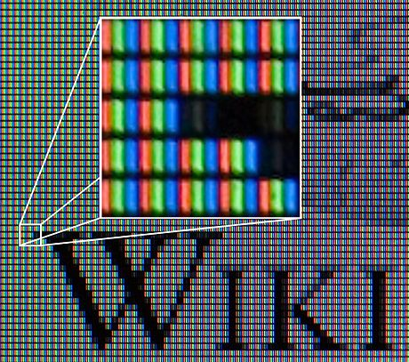
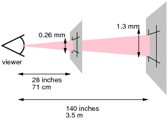

## web 常用长度单位

### 相对单位

1. px: 像素
2. em
3. vw/vh
4. %

### 绝对单位

1. in:
2. mm/cm
3. pt：1/72 inch
4. rem

### px

px（pixel、picture element）：图像的基本单元，既不是一个确定的物理量，也不是一个点或一个方块，它是一个抽象概念

像素一般分为两种描述：物理像素（设备像素）和 CSS 像素

#### 设备像素

显示器是由一个个物理像素点组成，每个点又包含三个单位（三元素组），**这些点就是设备像素**，通过控制每个像素点的颜色，来显示不同的图像



##### 设备分辨率

我们常用设备分辨率来描述设备像素

**分辨率**：为横向、纵向的像素点个数，例如 2880 x 1800 表示横向存在 2880 个物理像素点，纵向存在 1800 物理像素点

**原始设备分辨率（设备像素）**：显示器未经过操作系统设置的分辨率，例如 mac15.4 的 2880 x 1800

**桌面设定分辨率（设备像素）**：经过操作系统设置，可以对设备分辨率进行修改，例如将 mac15.4 分辨率修改 1680 x 1050

**PPI（像素密度）**：单位英寸的像素点个数，一般适用于显示器。通常 PPI 越高，图像显示越精细。例如 mac 15.4（分辨率 2880 x 1800，屏幕比例 16：10）的 PPI 为 220。**15.4 是斜边的长度，使用勾股定理计算直角边，再计算 PPI**

<font color="red">设备像素是可以变化的</font>，例如通过操作系统进行设置。当你降低设备分辨率时，每一个物理像素点就需要更多的三元素组来表示，此时**点的物理尺寸就增大了**。_最直观的变化是，屏幕字变大了_

#### CSS 像素

由于**不同种类的设备设备分辨率不同**，例如*1920 x 1080、2048×1536...*，**同种类设备分辨率也可能不同**，但对于 CSS 来说，它希望在所有设备看到的显示效果都差不多，所以 CSS 认为浏览器应该对像素进行调节，以便在不同设备看上去总是差不多。

##### 参考像素

CSS 使用参考像素来进行换算

1 参考像素即为从一臂之遥看解析度为 96DPI 的设备输出（即 1 英寸 96 点）时，1 点（即 1/96 英寸）的视角。它并不是 1/96 英寸长度，而是从一臂之遥的距离处看解析度为 96DPI 的设备输出一单位（即 1/96 英寸）时视线与水平线的夹角。通常认为常人臂长为 28 英寸，所以它的视角是: (1/96)in / (28in _ 2 _ PI / 360deg) = 0.0213 度



**当设备的典型观看距离越远时，参考像素就越大（注意这里的大，不是指视角变大，而是角度对应在屏幕上的尺寸变大）**

由于 css 像素是一个视角单位，所以在真正实现时，为了方便基本都是根据设备像素换算的。浏览器根据硬件设备能够直接获取 css 像素

[CSS 像素、物理像素](https://github.com/jawil/blog/issues/21)\
[每英寸像素、像素密度](https://zh.m.wikipedia.org/zh-hans/%E6%AF%8F%E8%8B%B1%E5%AF%B8%E5%83%8F%E7%B4%A0)\
[分辨率和像素](https://www.zhihu.com/question/21149600)\
[你真的了解 css 像素嘛](https://juejin.im/post/5b95a8186fb9a05cd7772455)

#### DIP（设备独立像素）

DIP：也成逻辑像素，根据官方定义，CSS 像素 == DIP

#### DPR

DRP（设备像素比）：指未缩放的情况下*CSS 像素*和*设备像素*的比例关系

DPR = CSS 像素 / 设备像素，可以使用 `window.devicePixelRatio` 来查询，例如 mac 15.4 的 DPR 为 2，则一个 CSS 像素由 2 个设备像素表示（2 个像素表示一个方向，**如果算上横向、纵向则是由 4 个设备像素**）

##### DPI 和 PPI

DPI：每英寸的点数，一般用于打印机、鼠标等设备

DPI 和 PPI：_一个点通常来说就是一个像素_，只是适用于不同的场合，例如图像一般使用 PPI，打印机一般使用 DPI

#### 那么一个像素到底多大呢？

在高分辨率设备下，1px 就等于 96 分之一英寸；对于低分辨率设备来说，anchor unit 是基于 pixel unit；

一般来说 windows 是 1/96 in；mac 是 1/72 in

## XSS

XSS（Cross Site Script）：跨站脚本攻击，为了避免和 CSS 命名冲突，所以改名为 XSS。之所以称为跨站脚本攻击，是因为最开始演示该攻击时，使用的时跨域，而对于现在来说，XSS 已经不存在跨域和不跨域之分了。

**XSS 攻击原理**：因数据转义不完善，攻击者通过 HTML 注入，向网页插入恶意脚本，从而控制用户浏览器，实施攻击。

### XSS 分类

1. 反射型 XSS（非存储型）：后端直接返回数据，不存在数据库中存储，例如 _JSONP 攻击_
2. 持久型 XSS（存储型 XSS）：将攻击数据存储于数据库中，典型是*留言板攻击*
3. DOM Based XSS：按照是否存储来说，DOM Based XSS 属于 反射性 XSS，但由于攻击原理，单独作为一条，例如 _input 输入构造 a 标签_

### XSS 攻击后果

**获取用户信息**

1. 获取 Cookie：读取 cookies 及 storages，获取用户登录信息
2. 识别用户浏览器信息：通过 user-agent 或浏览器独有方法和属性，识别浏览器
3. 识别用户软件：通过浏览器属性来识别用户安装软件
4. 获取用户真实 IP

**伪造恶意请求**

即使无法获取用户的登录信息，也可以直接在当前界面发送恶意请求

**界面显示不正确**

### XSS 攻击手段

1. MVC 框架输出、接口输出、JS 方法输出（HTML 输出，HTML 属性输出，Script 输出）
   - html 输出、模板输出：innerHTML、innerText 等拼接，例如 `<div>${i}</div>` i 为 `<script>alert(1)</script>`
   - script 输出：`var a = "${i}"`,i 为 `";alert(1)//`
   - a 标签：`<a href="${i}">` i 为 `" onclick=\"alert(1)\"\\`，或 `javascript:alert(1);`
2. base 标签
3. window.name
4. input、textarea 输入：输入`" onclick=\"alert(1)\"\\`
5. 富文本输入：输入`<script>alert(1)</script>`
6. Hash 输入：有时候会获取 Hash 值作为值进行赋值

**绕过 XSS Filter**

1. 利用字符串编码，减小执行代码长度
2. 利用 URL Hash

### XSS 防御

1. Cookie: HttpOnly
2. 输入判断
   - 安全编码：对输入的信息编码，例如 HTML 转义和 CSS 转义
   - input、textarea：正则判断输入（XSS Filter）
   - 富文本：使用白名单，只能使用指定标签（XSS Filter）
3. 输出判断

   - 安全编码：对输入信息编码，例如 HTML 转义和 CSS 转义
   - 对 innerHTML、innerText、document.write 等使用需要警惕（判断）

4. 对 location、cookie、window.name 等使用时，需要警惕（判断）

## CSRF

CSRF（Cross Site Request Forgery）：跨站点请求伪造，攻击者设置陷阱，诱骗用户进行操作，基于服务端对客户端的信任，实施攻击。*CSRF 的攻击的本质原因是**请求参数、地址可预测**，如果*使得请求变得不可预测，则 CSRF 攻击自然无效

### CSRF 攻击后果

用户在不知情下完成操作，如果设置到敏感操作，则会造成损失，例如*删除、支付等操作*

### CSRF 防御

1. **终极防御**：验证，验证是 CSRF 的终极防御，但是验证码过多对用户体验很不友好，所以只能是在很敏感的操作，才应该设置
2. token：增加有随机性的 Token，防止请求参数可预测。CSRF 多为 Cookie 会随着请求自动发送，并完成用户认真，所以可以使用 token，并对 token 进行校验，
3. Refer 检查

## Node 优化

1. 版本升级，Node 版本升级都伴随着的 V8 的版本升级和 Node 本身的性能提升，你无需做任何操作，只需要升级版本就可以提高性能
2. JSON 优化，使用 fast-json-stringfy 替代 JSON。_对于大众开发者来说，还无序计较此性能提升，最好还是使用语言本身的_
3. 使用 bluebird 替代 原生 Promise。_对于大众开发者来说，还无序计较此性能提升，最好还是使用语言本身的_
4. 正确的 V8 GC
   - 设置合适的新生代空间，避免频繁 GC，设置为 64MB（默认），128MB 较为合适
   - 使用大对象做为缓存，频繁 GC，_对于缓存，请使用缓存数据库_
5. 使用 Stream 替代全部加载内存操作（管道流，pipeline 方法操作）
6. c++ addon

### c++扩展一定比 js 快吗？

1. JavaScript 在 V8 上跑得比 C++ 扩展还快，这种情况多半发生在与**字符串、正则表达式相关**的场景，因为 V8 内部使用的正则表达式引擎是 irregexp，这个正则表达式引擎比 boost 中自带的引擎（boost::regex）要快得多

2. Node 在 C++扩展进行类型转换时，较为消耗性能，如果不注意 C++代码细节，则可能比耗费较多性能

## LeetCode

### 统计优美子数组

思路：遍历+滑动窗口

1. 遍历数组，计算数组每个奇数的位置，indexArr
2. 滑动窗口，从奇数位置数组中，取出 k 个奇数，设

假设当前位置为 i，i+k-1，则当前组合出来的可能性为

从第 i 位前的偶数总共为 c1 = (indexArr[i] - 1) - (indexArr[i-1] + 1) + 1 从第 i+k-1 位后的偶数总共为 c2 = (indexArr[i+k] - 1) - (indexArr[i+k-1] + 1) + 1

则此窗口组合的可能性为 (c1 + 1) _ (c2 + 1) ==> c1 _ c2 + c1 + c2 + 1

```typescript
/**
 * @param {number[]} nums
 * @param {number} k
 * @return {number}
 */
function numberOfSubarrays(nums: number[], k: number) {
  // 计算每个奇数索引位置
  let n = 0;
  const indexArr: number[] = [];
  for (let i = 0; i < nums.length; i++) {
    if (isOdd(nums[i])) {
      indexArr.push(i);
    }
  }

  // 判断所有奇数是否满足k
  if (indexArr.length < k) return 0;

  // 滑动窗口，窗口长度为k
  for (let i = 0; i <= indexArr.length - k; i++) {
    // start i；end i + k -1，且注意临界值
    const c1 = i === 0 ? indexArr[i] : indexArr[i] - indexArr[i - 1] - 1; // 计算左边的偶数
    const c2 =
      i === indexArr.length - k
        ? nums.length - indexArr[i + k - 1] - 1
        : indexArr[i + k] - indexArr[i + k - 1] - 1; // 计算右边的偶数

    n += (c1 + 1) * (c2 + 1);
  }

  return n;
}

// 计算是否为奇数，奇数的话，二进制最后一个一定是1，偶数一定不是1
function isOdd(n: number): boolean {
  return Boolean(n & 1);
}
```

**注意点**

1. 注意计算偶数的临街条件

[统计优美子数组](https://leetcode-cn.com/problems/count-number-of-nice-subarrays/)

### 硬币

思路：动态规划 f(n) = f(n-1) + f(n-5) + f(n-10) + f(n-25)；**千万注意递推公式，具有重复性**，所以，我们由从大到小计算，例如 先将为 1 的可能性全部计算完毕，再将为 5 的可能性全部计算完毕，以此类推，可以避免重复

```typescript
/**
 * @param {number} n
 * @return {number}
 */
function waysToChange(n: number): number {
  // 1，5，10，25
  if (n === 0) return 0;
  const store = new Array(n + 1).fill(1);

  // 开始计算每种结果，先计算为1的
  // for (let i = 1; i <= n; i++) {
  //   store[i] = 1;
  // }

  // 计算为5的
  for (let i = 5; i <= n; i++) {
    store[i] = (store[i] + store[i - 5]) % 1000000007; // 确定其中一个为5，剩下的算法
  }

  // 计算10
  for (let i = 10; i <= n; i++) {
    store[i] = (store[i] + store[i - 10]) % 1000000007; // 确定其中一个为10，剩下的算法
  }

  // 计算10
  for (let i = 25; i <= n; i++) {
    store[i] = (store[i] + store[i - 25]) % 1000000007; // 确定其中一个为25，剩下的算法
  }

  return store[n];
}
```

**注意点**

1. 注意递推公式的重复性，例如 6 => 5（5，1 x 5）+ 1 或 1 x 6，但 **1 x 6 包含了 1 x 5**，如果纯按递推公式，则会导致重复

**为什么上述算法不会重复：**拿 6 来说，按照普通的动态规划，出现重复的原因是**重复计算 1**，f(0)由常量 1 表示：`f(6) = f(5) + f(1) ==> f(4) + f(0) + f(1) ... ==> f(1) + f(1) + 1`，此时计算了两次 f(1)，所以会出现重复

而上述算法，一次计算，先计算 f(1)，后续计算中不再次重复计算 f(1)了

[硬币](https://leetcode-cn.com/problems/coin-lcci/)

### 数组中的逆序对

思路：归并排序，归并排序是一个将两个有序数组合并为一个大有序数组的方法，而归并时，会出现如下情况： [a1,a2,a3,a4]，[b1,b2,b3,b4]，如果 ai > bj 时，则可以出现 [ai,bj], [ai,bj-1]...[ai,b0]，j++；如果 ai < bj，则无法组成逆序，则 i++，继续比较

```typescript
/**
 * @param {number[]} nums
 * @return {number}
 */
function reversePairsnums(nums: number[]): number {
  if (nums.length <= 1) return 0;

  return mergeSort(nums, 0, nums.length - 1);

  // 归并排序方法
  function mergeSort(arr: number[], s: number, e: number) {
    if (s >= e) return 0;
    const newArr: number[] = [];
    const mid = (s + e) >> 1;

    let sum = mergeSort(arr, s, mid) + mergeSort(arr, mid + 1, e);

    // 合并
    let i = s;
    let j = mid + 1;
    let ind = s;

    while (i <= mid && j <= e) {
      if (arr[i] <= arr[j]) {
        // 要移动ai了，此时可以知道了bj的位置，就可以知道小于ai的个数了
        newArr[ind++] = arr[i++];
        sum += j - mid - 1;
      } else {
        // 移动bj了，此时可以知道bj左边全部比ai小
        newArr[ind++] = arr[j++];
      }
    }

    while (i <= mid) {
      // ai未移动完，则直接赋值
      newArr[ind++] = arr[i++];
      sum += j - mid - 1;
    }

    while (j <= e) {
      // bi未赋值完
      newArr[ind++] = arr[j++];
    }

    for (let i = s; i <= e; i++) {
      arr[i] = newArr[i];
    }
    return sum;
  }
}
```

**注意点**

1. 也可以在移动 bj 时计算，此时 a 数组剩余的全是大于 bj 的

[数组中的逆序对](https://leetcode-cn.com/problems/shu-zu-zhong-de-ni-xu-dui-lcof/%20%E6%95%B0%E7%BB%84%E4%B8%AD%E7%9A%84%E9%80%86%E5%BA%8F%E5%AF%B9/)
