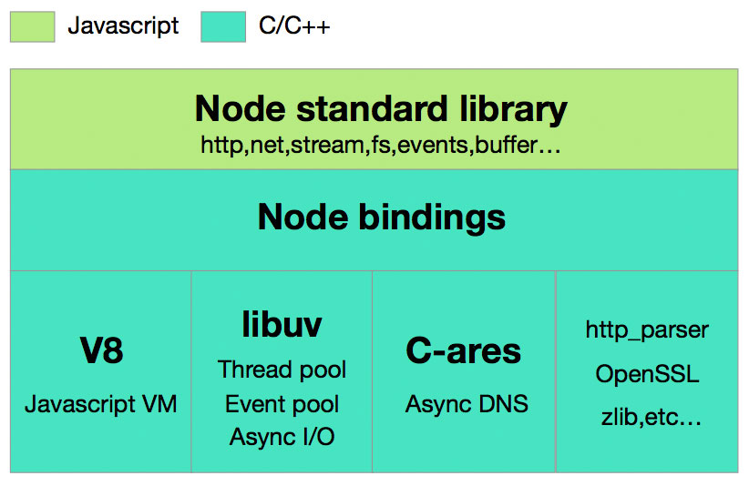
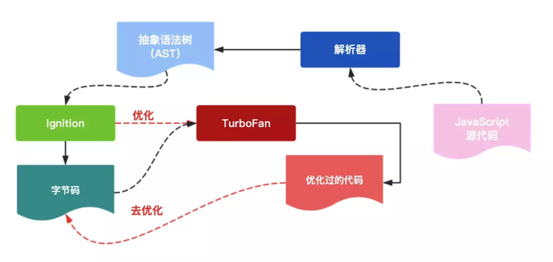
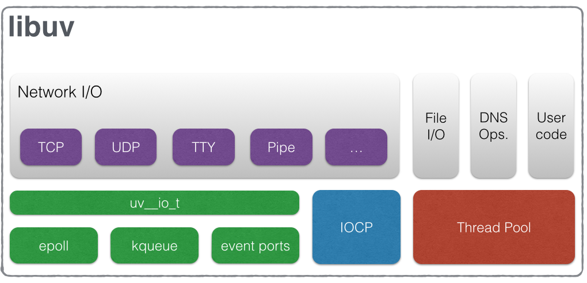
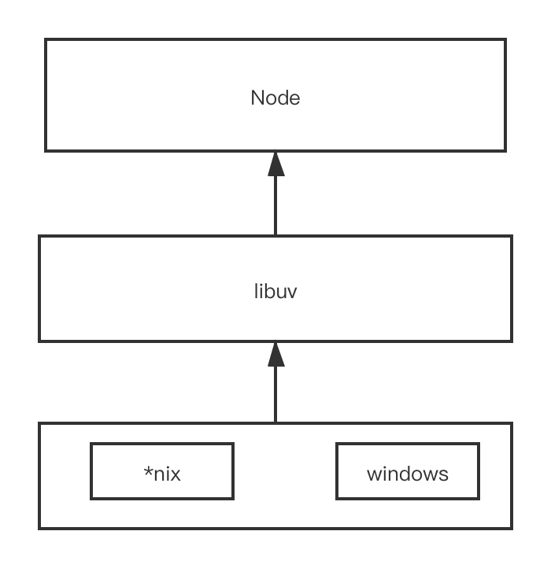

## Javascript

## Node

### Node 架构



1. Node Standard Library: 以 Javascript 呈现的 Node Module，平时用的最多的模块
2. Node Bindings: Node Standard Library 和底层 C++代码沟通的桥梁，隐藏底层实现
3. 底层依赖

   - v8: Javascript 引擎，执行 Javascript 代码
   - libuv: 1. 事件循环；2. 平台兼容；3. 异步、非阻塞 I/O；4. 对 I/O 抽象为流或句柄
   - c-ares: 异步 DNS
   - http_parser: http 解析
   - openssl: 提供 ssl
   - zlib: 压缩
   - ...

#### V8



Source Code => Parser => AST => Ignition => Byte Code => 执行

**JTI**( Ignition => TurboFan => Native Code )

##### Isolate

隔离实例: Isolate 就是 v8 实例，但是两个实例之间完全独立，互不干扰。tips: Isolate 并不会执行 Javascript，而是由内部的 Context 执行

##### Handle

句柄: Heap 中对象的引用。在 v8 中，Javascript 对象都存储于 Heap 中，Handle 指向该 Heap 中的数据，当 Heap 中对象不存在 Handle 引用时，则 GC 会将其回收

tips: _为什么使用 Handle，而不用指针?_。由于 GC 的原因，Javascript 对象在 Heap 中的位置会移来移去，如果出现移动，则**指针会成为野指针**，而 Handle 会在 GC 时进行更新。

一般为分: `Local<>, Persistent<>, Eternal<>, MaybeLocal<>, ...`

##### HandleScope

句柄作用域: 管理句柄的容器。句柄用来引用对象，当句柄数量增加时，管理就和麻烦，所以使用句柄作用域来管理句柄。当句柄作用域销毁时，整个作用域中的句柄同时被销毁

`HandleScope、EscapeHandleScope`

##### Context

上下文: 执行 Javascript 代码的环境。在执行 Javascript 时，需要的全局变量和环境变量，由 Context 提供。**上下文独立存在，且互不影响**

从 CPU 和内存角度来说，创建新的 Context 消耗巨大，存在以下手段进行优化

1. v8 缓存: 由于创建 Context 性能大头在于 **创建 Javascript 内置对象**，而这些对象只会执行一次，在下次创建时不会再执行
2. 快照: 将创建好的内置对象存放于快照中，再创建时从快照提取

#### libuv



libuv 将 I/O 分为两类，一类是 _Network I/O_，另一类是 _File I/O，DNS，User Code_

1. Network I/O: 对于网络请求，libuv 在不同平台使用各自的操作系统处理，例如 Windows(IOCP)、Mac os(kqueue)、Linux(epoll)，并进行抽象，对上层提供统一 API
2. File I/O、DNS、User Code: 使用线程池

### Node 特点

#### 跨平台

使用 libuv 夸平台。libuv 对各个平台操作系统进行抽象，隐藏底层实现细节，向上抛出统一 API



#### 异步、非阻塞 I/O

异步和非阻塞其实是不一样的:

异步: 表示操作和得到结果在空间或时间上不同步。例如 Ajax 请求，你无法预测该请求何时完成

非阻塞: 当前执行代码不会阻塞后续代码执行

Node 异步、非阻塞 I/O 基于 libuv 实现

#### 事件驱动

Event Loop: 类似于 `while(true){}` 的机制，每一个 Tick 取出事件回调函数，交于主线程执行，当全部回调函数执行完毕或超出最大执行数，则跳出，并进入下个 Tick

Node 对不同种类事件有不同的观察者，_I/O_、_定时器_ 等为生产者，生产的事件被送到不同的观察者，Event Loop 从观察者取走事件，并根据事件取出回调函数，交给主线程执行

#### 单线程

Node 单线程仅仅是**主线程是单线程**

单线程优势在于*不用处理状态锁*，*无线程切换消耗*等。劣势在于*无法利用多核 CPU 优势 (child_process)*,_CPU 密集型任务阻塞 (child_process,c++扩展)_，_报错后程序终止 (pm2)_

## 网络

### HTTP

客户端使用 URL，通过 HTTP 协议，获取 HTML 等资源

#### URI，URL，URN

1. URI: 统一资源标识，使用一串字符来表示互联网的资源
2. URL: 统一资源定位，使用一串字符串来定位互联的资源，**属于 URI 的子集**
3. URN: 统一资源名称，带有名称的互联网资源，**属于 URI 子集**

#### Method

1. GET: 获取资源
2. POST: 传输对象实体
3. PUT: 语义传输文件，在 REST 中常使用为更新
4. PATCH: 语义更新文件，但不常用
5. DELETE: 删除
6. OPTIONS: 查询支持请求方法
7. HEAD: 只获取头部，不需要内容(204)
8. TRACE: 路由跟踪
9. CONNECT: 隧道

#### Request

```
Request Line // ps GET / HTTP/1.1
Request Header
换行符
Request Entity
```

#### Response

```
Response Line // ps 200 ok HTTP/1.1
Response Header
换行符
Response Entity
```

#### 传输特点

1. 无状态协议（cookie）
2. 短连接（keep-alive）
3. 多对象传输，可传输文本，二进制文件等，可根据 MIME 定义
4. *Range*头部设定请求范围，响应状态码为*206*
5. 内容协商
   - 客户端驱动协商: 以 JS 或用户选择使用。ps 看电影选择高清还是超清
   - 服务端渠道协商: 根据客户端传输数据，自动选择。ps Accept 头部
   - 透明协商: 综合客户端驱动和服务端驱动
6. 可压缩，gzip，br，compress...

#### 报文和实体

报文: 由 8 字节流组成的，HTTP 基本传输单位。

实体: 作为 HTTP 请求和响应的有效载荷，分为*实体首部*和*实体主体*（ps，一般说的实体都是指的是*Body Entity*）

HTTP 报文主要用于传输请求和响应的实体主体

实体主体一般和报文主体相同，_但采用压缩编码时，则不相同_

#### 网络五层

```
应用层（报文）
传输层（报文段）
网络层（数据报）
链路层（帧）
物理层（二进制数据流）
```

##### 链路层和物理层区别

**物理层**: 传输比特流的介质，该层不关心物理介质（例如双绞铜线、同轴光纤、光纤），只关心传输

**链路层**: 由于物理层只传输比特流，且物理信道不可靠，链路层在物理层基础进行抽象，使用协议控制将**物理信道**抽象为**可靠传输，无差错的链路**。其中，_**链路**表示表示相邻的链路节点的连接_

1. 将网络层传输的数据报，封装成帧
2. 链路接入
3. 可靠交付
4. 差错校验，错误纠正

##### IP 地址和 MAC 地址

**IP 地址**: 网络层定义的协议。

1. 以 IPV4 来说，32 位 IP 地址以 "." 形式连接表示，ps 192.168.0.0。
2. IP 地址定义的是**子网的地址**，通过子网掩码来表示不同子网，ps 10.1.0.0/16 表示以 10.1.x.x 表示的为同一子网

**MAC 地址**: 每台机器想要访问网络，则必须具有 "网卡"，每个网卡在生产时被打上唯一标识，此为 MAC 地址（物理地址）

**如何知道 MAC 地址**

ARP（Address Resolution Protocol）: 地址解析协议。路由器包含 IP 地址到 MAC 地址映射，同一个子网内，可以通过 ARP 协议获取 MAC 地址。但当*两个 IP 地址不处于同一个子网*，则必须交给两个子网**连接网关**处理

**获取 MAC 地址如何传输**

以太网采用的时广播，即向子网所有机器发送帧。当适配器（"网卡"）接收到帧时，判断与自身 MAC 地址是否相等，如果相同则接受数据，否则丢弃

**MAC 地址和 IP 地址区别**

MAC 地址描述的是**设备地址**，IP 地址描述的是**子网地址**，首先通过 IP 地址找到子网，再通过 MAC 地址找到设备。如果不存在 IP 地址，只使用 MAC 地址话，则网络会充满无用数据

## 算法

### 最长增子序列

设: 数组为 arr，结果数组为 res

**思路 1: 动态规划**

当下标为 n 时，沿着 n 想钱查找，找到 j 且 arr[j] < arr[n]，则 f(n) = res[j] + 1，如果未找到 j，则 f(n) = 0; 思路 2: 动态规划升级

递推公式: fn(n) = j ? res[j] + 1 : 1;

**思路 2: 动态规划升级**

res 存储最大增子序列，且 按照升序存储，当遇到新的数时

1. 如果 arr[n] 比 res 最大的数值还要打大，则 res 增加一个
2. 否则，将 arr[n] 替换掉 res 中的适合位置，以保证 res 中永远存储的较小的数

**合适的位置**: i 从 arr.length-1 开始，找到 res[i] < arr[n] 的位置，与 i 后一位替换。 例如 [1, 4, 5, 10] 插入 9，则当 i=2 时，满足 res[i] < 9，则替换掉 10 => [1, 4, 5, 9]

递推公式: arr[n] > res[res.length -1] ? res[res.length] = arr[n]; fn(n) = res.length : 寻找合适位置替换; fn(n) = res.length

```typescript
function lengthOfLIS(nums: number[]): number {
  if (nums.length <= 1) return nums.length;

  const res: number[] = [nums[0]];
  let len: number = 1;
  let i: number = 1;

  while (i < nums.length) {
    if (nums[i] > res[len - 1]) {
      // 如果大于目前存储的最大值，则新增该元素
      res[len++] = nums[i];
    } else {
      // 否则需要替换结果元素，且放到合适位置
      const validIndex: number = findValidIndex(0, len - 1, nums[i]);
      if (validIndex !== -1) {
        res[validIndex] = nums[i];
      }
    }
    i++;
  }

  return res.length;

  function findValidIndex(start: number, end: number, n: number): number {
    // 注意此处二分比较，必须是>，因为有可能 start===end时，不是寻找的值，例如 [2, 5, 6] 插入 4，当 0===0，并不是合适的位置
    if (start > end) {
      return start;
    }

    const mid = Math.trunc((start + end) / 2);
    if (res[mid] === n) {
      return -1;
    } else if (n > res[mid]) {
      return findValidIndex(mid + 1, end, n);
    } else {
      return findValidIndex(start, mid - 1, n);
    }
  }
}
```

[最长增子序列](https://leetcode-cn.com/problems/longest-increasing-subsequence/)

### 组合最长回文字符

思路: 回文字符可以是如下形式: ...ZXYXZ...、XYYX。由此可推导 将可以整除 2 的字符全部相加，_如果还存在单的字符，则还可以置于中间_

```
function longestPalindrome(s: string) {
  if (s.length < 2) return s.length;

  const set = new Set();
  let count = 0;

  for (let i = 0; i < s.length; i++) {
    if (set.has(s[ i ])) {
      count += 2;
      set.delete(s[ i ]);
    } else {
      set.add(s[ i ]);
    }
  }

  return set.size > 0 ? count + 1 : count;
}
```

[组合最长回文字符](https://leetcode-cn.com/problems/longest-palindrome/)
