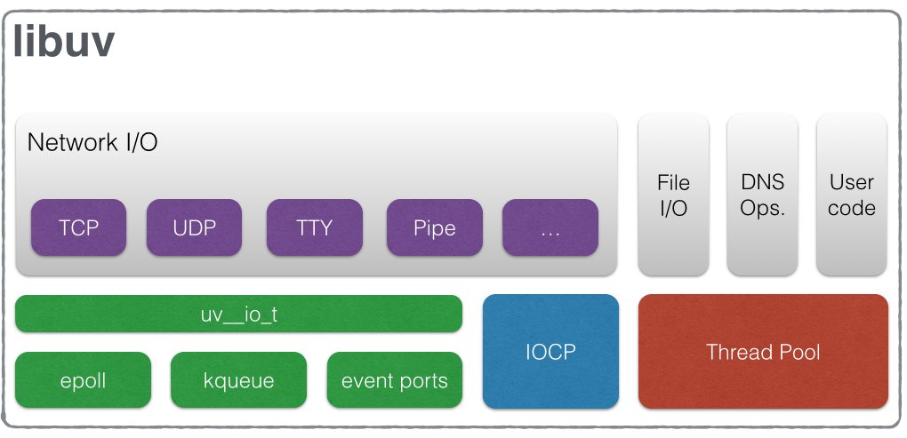

# 11 月第 4 周

## Javascript

### Module

#### 模块加载 Script

`<script></script>` script 标签载入脚本

**属性**：

- type：脚本类型，常用的有 text/javascript，application/javascript，module 等
- src：脚本 URL 地址
- async：异步加载
- defer：异步加载
- crossorigin：脚本可跨域
- nomodule：不支持 module 浏览器会识别
- text：动态载入脚本时，可以在脚本内插入可执行代码。_MDN 给出和 textContent 不一致，textContent 插入字符串不可执行，而 text 可执行_，**但在 Chrome 下测试都可以执行**
- lang：段落格式，可以使用`<script lang="ts"></script>`

---

- language:废弃
- charset：废弃

**async 和 defer**

共同点：

1. 都是为异步加载，且**立即开始下载脚本**，**下载时不阻塞 DOM 解析**
2. 无法对内联脚本生效（无 "src" 脚本）

不同点：

- async：
  1. 脚本下载完成后，立即开始运行，且阻塞 DOM 解析
  2. 脚本之间完全无序
- defer：
  1. 脚本下载完成后，等待 DOM 解析完成后，且在 DOMContentLoaded 之前开始运行
  2. 脚本之间有序

<font color="red">ECMA 规定 defer 必须在 DOMContentLoaded 前执行，且必须有序，但目前浏览器并未完全遵守，且不一定有序，请谨慎使用</font>

**module 加载**

为了使脚本加载更快，将支持 ECMA 模块和不支持的区分开，加载不同的模块

```html
<script type="module" scr="module.js"></script>
<script type="nomodule" scr="bundle.js"></script>
```

但是上述方法存在兼容性，某些浏览器不支持 nomodule，也不支持 module，所以采用如下兼容

_通过全局变量控制_

```
<!-- use a module script to detect modern browsers: -->
<script type=module>
  self.modern = true
</script>

<!-- now use that flag to load modern VS legacy code: -->
<script>
  addEventListener('load', function() {
    var s = document.createElement('script')
    if (self.modern) {
      s.src = '/module.js'
      s.type = 'module'
    }
    else {
      s.src = '/compile.js'
    }
    document.head.appendChild(s)
  })
</script>
```

_通过动态脚本控制_

```
var s = document.createElement('script')
if ('noModule' in s) {  // notice the casing
  s.type = 'module'
  s.src = '/module.js'
}
else
  s.src = '/compile.js'
}
document.head.appendChild(s)
```

## Typescript

## Node


### Libuv 概览



### Module

Node 模块遵循 CommonJS 规范，大致表现为以`exports/module.exports`导出模块，以`require`加载模块

#### Node 模块定义

在 node 源码内

```
// lib/internal/modules/cjs/loader.js

...

function Module(id, parent) {
  this.id = id;
  this.exports = {};
  this.parent = parent;
  updateChildren(parent, this, false);
  this.filename = null;
  this.loaded = false;
  this.children = [];
}
...
Module._cache = Object.create(null);
Module._pathCache = Object.create(null);
Module._extensions = Object.create(null);
var modulePaths = [];
Module.globalPaths = [];
...
let wrap = function(script) {
  return Module.wrapper[0] + script + Module.wrapper[1];
};
...
const wrapper = [
  '(function (exports, require, module, __filename, __dirname) { ',
  '\n});'
];
```

定义 Module 构造函数，属性、方法，静态属性、方法，包装函数等，简单介绍些几个熟悉的：

可以使用`require.main来查看以下属性`

- id：模块 id，模块文件名，例如 `require("${id}")`
- exports：就是常说的 exports 属性，_exports 和 module.exports 的纠纷_
- parent：最先引用该模块的模块
- filename：文件的绝对路径
- loaded：是否加载完毕，在循环引用时，这个参数可以表明模块是*加载完成了还是未完成对象*
- children：该模块引用的模块

---

可以使用`const Module = require('module'); 来查看一下属性`

- \_cache：常说的缓存
- \_extensions：常说的文件的加载后解析函数，_.node,_.js,\*.node 都有不同的解析函数
- globalPaths：全局的 node 解析路径 `${HOME_PATH}/.node_modules; ${HOME_PATH}/.node_libraries; ${NODE_DIR}/lib/node`

**模块包装**

每个模块包装在 wrap 函数中，即每个模块都是如下定义的

```
(function (exports, require, module, __filename, __dirname) {
  ...
});
```

所以在模块内部能访问到 `exports, require, module, __filename, __dirname`

#### 模块加载

node 中使用 `require("${id}")` 加载模块，实现代码如下

```
// lib/internal/modules/cjs/loader.js

Module.prototype.require = function(id) {
  ...
  return Module._load(id, this, /* isMain */ false); // require真正实现
};

Module.prototype._compile = function(content, filename) {
  ...
  var require = makeRequireFunction(this); // 此处定义了wrap函数中的require函数，调用makeRequireFunction
};


// lib/internal/modules/cjs/helpers.js
function makeRequireFunction(mod) {
  const Module = mod.constructor;
  function require(path) {
    try {
      exports.requireDepth += 1;
      return mod.require(path); // 调用的时mod.require，即Module.prototype.require
    } finally {
      exports.requireDepth -= 1;
    }
  }

  function resolve(request, options) {
    validateString(request, 'request');
    return Module._resolveFilename(request, mod, false, options);
  }

  function paths(request) {
    validateString(request, 'request');
    return Module._resolveLookupPaths(request, mod, true);
  }

  // 单纯赋值，很多值都可以从require获取，不用去Module获取
  require.resolve = resolve;
  resolve.paths = paths;
  require.main = process.mainModule;
  require.extensions = Module._extensions;
  require.cache = Module._cache;

  return require;
}
```

由于\_load 方法才是核心函数，所以单独放置

```
// lib/internal/modules/cjs/loader.js
Module._load = function(request, parent, isMain) {
  if (parent) {
    debug('Module._load REQUEST %s parent: %s', request, parent.id);
  }

  var filename = Module._resolveFilename(request, parent, isMain);

  var cachedModule = Module._cache[filename];
  if (cachedModule) {
    updateChildren(parent, cachedModule, true);
    return cachedModule.exports;
  }

  if (NativeModule.nonInternalExists(filename)) {
    debug('load native module %s', request);
    return NativeModule.require(filename);
  }

  // Don't call updateChildren(), Module constructor already does.
  var module = new Module(filename, parent);

  if (isMain) {
    process.mainModule = module;
    module.id = '.';
  }

  Module._cache[filename] = module;

  tryModuleLoad(module, filename);

  return module.exports;
};
```

整体步骤为：

- 路径分析，文件定位

- 去 `Module._cache` 缓存查看是否存在，如果存在缓存则直接返回缓存
- 是否为内置模块，如果是内置模块，则调用 NativeModule.require，并返回
- 否则为文件模块（包括源代码和第三方模块），此时执行如下步骤
  - 是否标识为主模块，即入口文件
  - 以文件绝对路径为 key 缓存文件模块
  - 运行文件，根据文件扩展名，使用`Module._extensions[extension](this, filename);`来加各个类型文件，最终以 `Module._compile` 运行
  - 返回 `module.exports`，如果你想查看文件模块，可以在`require.main.children`去查找，或者去`require.cache[ require.resolve("${id}") ]`查找

[node Module 文档](http://nodejs.cn/api/modules.html)

##### 路径分析

**判断路径是否为内置模块**

如果为内置模块，直接返回。可以使用 `process.binding('natives').hasOwnProperty('${id}')`来模拟

**判断是否为相对路径、绝对路径**

如果为相对路径('./')和绝对路径('/')，则转换为真实路径

**文件模块**

否则为文件模块，在 node_modules 文件夹下查找，`["./node_modules","../node_modules", ...]`直到根路径，可以使用`require.main.paths` 来查看主模块 paths

此外，Node 还会搜索

- \$HOME/.node_modules
- \$HOME/.node_libraries
- \$PREFIX/lib/node

及环境变量 NODE_PATH 规定的目录

##### 文件定位

**分析文件扩展名**

Node 将依次分析 _.js，_.json，\*.node 文件，存在即返回该文件，不会继续寻找

**查询文件夹**

如果未查找到文件，则会继续寻找文件夹，规则如下

1. 如果当前文件存在 package.json，且存在 main 属性，则以 main 指定文件为准
2. 否则依次寻找 index.js，index.json，index.node，存在即返回该文件，不会继续寻找

**如果在所有路径下都未找到，则抛出错误**

##### 文件执行

Node 根据文件扩展名调用不同的解析文件方法，如下所示

```
*.js => module._compile(stripBOM(content), filename);
*.json => module.exports = JSON.parse(stripBOM(content));
*.node => process.dlopen(module, path.toNamespacedPath(filename));
```

#### 循环加载

如果文件出现循环依赖，则会**返回未完成对象**，即 module.load 为 false，且会**将循环依赖文件执行完毕**后，才执行主文件

例如 A 为入口文件，A 依赖 B,B 依赖 A，则

```
A 指定后跳转 B 执行
B 执行时发现存在循环依赖，则返回 B 未完成对象
B 继续执行完毕后，返回 A 执行
```

### NPM

#### install

`npm install --verbose`

## C++

## 网络

### HTTP

#### 请求方法

- GET：获取资源
- POST：上传资源
- PUT：请求负载替换指定资源（全量覆盖，幂等方法）
- PATCH：对资源进行过部分修改（非幂等）
- DELETE：删除指定资源
- HEAD：头部请求，不能返回 Body Entity
- OPTION：获取目标资源支持的通信选项
- TRACE：目标资源路径消息回环测试
- CONNECT：HTTPS 隧道连接

#### 特点

- 非持续连接 采用 Connection: Keep-Alive 表示持续连接，Connection: close 断开链接
- 无状态协议：Header；Cookies 传递消息（依赖 Cookie 和 Set-Cookie 头部）
- 停止等待：下一个请求必须等到上一个请求返回才能发送，PipeLining，使用户管线话，同一个 TCP 连接支持多个 HTTP 请求同时发送，但**响应还是有序**的
- 数据压缩：压缩数据减少传输体积，常用算法为 Gzip, Brotli, Compress 等
- 代码分块传输：Transfer-Encoding: chunked
- 多对象传输：Content-Type: multipart/form-data
- 分批次请求
- 内容协商：Accept：接收文件类型，如 text/html，Accept-Encoding：接收编码方式,如 gzip，Accept-Language：接收语言，如 zh-cn、en

#### HTTP Status Code

1. 1xx：接收处理

   - 100：表示客户端应该继续操作，如果以完成则忽略。_在传输大文件时，客户端会发送 Except:100-continue，而后返回值必须为 100 才能发送 Body Entity_，但是 RFC 并未规定 POST 必须发送该报文，在 curl 测试中只存在一次发送

2. 2XX：成功

   - 200：成功
   - 200（from cache）：强制缓存
   - 204：No-Content
   - 206：分批次请求

3. 3XX：重定向

   - 301 ：永久重定向
   - 302：临时重定向，<font color="red">该状态码其实不允许客户端改变请求方法，例如将 POST 改为 GET，但是很多浏览器都是按照 303 来实现的，所以重新规定了 307</font>
   - 303：临时重定向，且必须转为 GET 方法获取
   - 304：协商缓存
   - 307：临时重定向，且不能改变请求方法

4. 4XX：客户端错误

   - 400：请求错误，Bad Request。例如参数错误等
   - 401：未认证 Unauthorized
   - 403：禁止访问 Forbidden
   - 404：资源未找到 Not Found
   - 405：该资源不支持该 HTTP Method，Method Not Allowed

5. 5XX：服务端错误
   - 500：服务器错误 Internal Server Error
   - 501：未实现，表示服务器不认识该请求方法 Not Implemented。例如使用 HTTP RPC 未定义的 HTTP Method，但是很多服务器会返回 400，例如 Node.js
   - 502：错误网关，Bad Gateway
   - 503：服务器无法到达，可能由于服务器过载 Service Unavailable
   - 504：网关超时，Gateway Timeout
   - 505：HTTP 版本不支持，HTTP Version Not Support

## 算法

### 动态规划

#### 最小三角形和（练习题）

给定一个三角形，找出自顶向下的最小路径和。每一步只能移动到下一行中相邻的结点上。

例如，给定三角形：

```
[
     [2],
    [3,4],
   [6,5,7],
  [4,1,8,3]
]
```

思路：动态规划

1. 找出递推公式 dp[i] = min(dp[i]上层左边的值,dp[i]上层右边的值) + n[i]，但 dp[i]上层可能不存在，递推出

```
dp[i][j] =  if ( !dp[i-1][j] ) { dp[i-1][j-1] + n[i][j]; }
            else if (!dp[i-1][j-1]) { dp[i-1][j]   + n[i][j]; }
            else { Math.min( dp[i-1][j-1], dp[i-1][j]) + n[i][j] }
```

2. 确定存储数据结构：矩阵

```
function minTriangle(arr: number[][]) {
  if (arr.length < 1) return 0;
  const store: number[][] = [ arr[ 0 ] ]; // 确定存储

  for (let i = 1; i < arr.length; i++) {
    store[ i ] = [];
    for (let j = 0; j < arr[ i ].length; j++) {
      // 根据递推公式
      if (!store[ i - 1 ][ j ]) {
        store[ i ][ j ] = store[ i - 1 ][ j - 1 ] + arr[ i ][ j ];
      } else if (!store[ i - 1 ][ j - 1 ]) {
        store[ i ][ j ] = store[ i - 1 ][ j ] + arr[ i ][ j ];
      } else {
        store[ i ][ j ] = Math.min(store[ i - 1 ][ j ], store[ i - 1 ][ j - 1 ]) + arr[ i ][ j ];
      }
    }
  }

  return Math.min(...store[ arr.length - 1 ]);
}
```

## LeetCode
