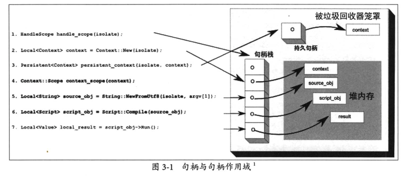

# 11 月第 4 周

## Javascript

### 协程

_进程_：操作系统对运行程序的抽象，是计算机分配资源的最小单位，不同线程互相隔离；
_线程_：¬ 是操作系统调用的最小单位，是程序执行的最小单位，同个进程下的线程共享资源；
_协程_：也称微线程，以线程形式运行，属于线程；

**并发演变（自己整理的简略版）**：

_进程_：在单核（单核单进程）计算机上，不存在并发，操作系统利用**时间片轮转（RR 调度）**来模拟并发。时间片轮转简单来说就是执行一会 A ，暂停，将 A 状态保存，执行一会 B ，保存 B 的状态，再次执行 A...，由于操作系统快速切换，看起来就像并发。在现代计算上（多核多进程），当执行线程数小于计算机进程数时（非指 CPU 核心数，现代计算机利用超线程技术，实现多核多进程，例如 4 核 8 线程），是真正意义的并发，每个线程运行于不同的核心，同时运行，但是当进程大于计算机进程数时，必然存在线程运行多个程序，此时利用时间片轮转实现假并发。

_线程_：多个线程可运行同一个进程下，但线程没有正真意义的并发，也是利用**时间片轮转**实现并发，但线程之间切换要比进程切换消耗小很多

_协程_：多个协程可运行于同一个线程下，但协程之间是由**用户实现协程切换，而非操作系统**，**不存在系统调用，无上下文切换**，效率较高；且运行于同一个线程，避免竞争关系使用锁

## Typescript

## Node

### 性能钩子

实验性 API，监测性能，例如测量函数运行时间

```typescript
import {
  Performance,
  PerformanceEntry,
  PerformanceObserver,
  performance,
} from 'perf_hooks';

function test() {
  console.log('TEST');
}

const obs = new PerformanceObserver(list => {
  console.log(list.getEntries()[0]);
  obs.disconnect();
});

obs.observe({ entryTypes: ['function'] });

performance.timerify(test)();
```

### process

主进程抽象

**主进程事件**

部分事件未捕获，则最终会传递到 process，如

- rejectionHandled：在下一个事件循环内未补货 Promise Rejected，可能是由于 Promise 在未来某个时间点捕获，比事件循环稍晚
- unhandledRejection：未捕获的 Promise Rejected
- uncaughtException：未捕获的错误，此时程序已经崩溃，不能用作异常处理，应该直接杀死或重启（如 pm2）

### Node 最佳实践

#### 环境变量建议

1. 不在工程维护单独的环境变量，例如 env.dev、env.test、env.prod
2. 在外部单独维护，例如在单独工程中配置不同环境的变量

#### 模块划分建议

1. 模块以业务功能划分，不以角色划分（不以 service,controller 划分），例如

```
- user
  - user.controller.js
  - user.service.js
  ...
```

#### 错误处理

区分为**操作错误、程序错误**

1. 操作错误：用户操作错误，仅仅提供日志记录
2. 程序错误
   - 致命程序错误：例如 uncaughtException，应该直接重启
   - 普通程序错误：例如 unhandledRejection，以 error 等级 记录

**建议不要在公共中间件中处理错误，可以使用单独的错误捕获方法**

##### stack-trace

在 Javascript 中以，`console.log(Error.stack)`或者`console.trace(Error)`，大部分 runtime 都实现了

**v8 stack-trace**

在 node 中，错误栈信息一般为 10 帧，可以通过如下来改变

```
Error.stackTraceLimit = 10

--stack-trace-limit <value>
```

使用 `longjohn` 包，但不要在生产使用
具体错误追踪[JavaScript 错误处理和堆栈追踪](https://github.com/dwqs/blog/issues/49)

#### 监控

- 阿里云 Node 平台
- [Node 与普罗米修斯](https://community.tibco.com/wiki/monitoring-your-nodejs-apps-prometheus)
- [Node 和 k8s](https://nodesource.com/blog/orchestrating-nodejs-containers-with-kubernetes/)

#### 安全建议

- 代码安全检查：eslint-plugin-security
- 中间件并发速率限制：express-rate-limit，koa/limitRate，express-brute
- 机密配置信息的安全性
- 防止注入攻击
- 库的安全检测，`sync`,`npm audit`
- 黑名单
- 防止 root 用户运行
- 限制负载大小，Body 越大，所需要的内存空间越多，可能导致 DOS 攻击
- 恶意正则，使用`safe-regex`库
- HTTPS

#### 调试建议

- 区分环境变量
- 使用 longjohn 包，追踪错误栈

```
if (process.env.NODE_ENV === 'development') {
  Error.stackTraceLimit = Infinity;
  require('longjohn');
}
```

- 尽量使用具名函数
- 使用编辑器 DEBUG
- NODE_DEBUG 可以用来 DEBUG 核心模块，例如 `NODE_DEBUG=http,net node main`

### C++扩展

#### V8 高性能原因

1. JIT
2. 缓存
3. GC
4. 隐藏类：对于对象的一种包装，<font color="red">所有属性相同的对象归于同一个隐藏类</font>

```

function Pet(name:string,type:string){
  this.name = name;
  this.type = type;
}

const p1 = new Pet('cat','cat');
const p2 = new Pet('dog','dog');

1. 执行到 new Pet('cat','cat') 时，创建隐藏类 P0(空类)，

- 在赋值 this.name = name；时，基于 P0 创建隐藏类 P1，此时 P1 具有 name 属性
- 在赋值 this.type = type; 时，基于 P1 创建隐藏类 P2, 此时 p2 具有 type 属性

在 new Pet('dog','dog')  时，公共同一个隐藏类
```

#### 为什么需要 C++扩展

1. 性能：C++ 在 CPU 密集型任务高出 Node 性能太多
2. 成本：很多已经存在 C++包，只需要封装成 C++插件，而无序重新开发

#### V8 内存机制

明确一点：**Node 中所有对象（除开 Buffer 和 TypedArray），都是由 V8 进行内存管理**。如：在 Node 中创建对象，实际上就是在 V8 中开辟存储空间，且该空间可以被 C++代码所操作（_前提是在同个作用域下_）

1. 新生代区
2. 老生代指针区
3. 老生代数据区
4. 大对象区
5. 代码区(JIT 编译后的代码)
6. Map，Cell...区

共同由 GC 管理，GC 算法特点：**惰性，步进**

新生代区：Scavenge 算法
老生代区：Mark-Sweep 和 Mark-Compact（将存活对象尽量移动到内存左侧，将空白内存置于右侧）

#### V8 内部对象

##### Isolate

v8 实例，且每个实例之间处于隔离，所以也称为*隔离实例*

```
CreateParams params;
v8::Isolate *isolate = v8::Isolate::New(params); // 实例化，但一般不用这个

v8::Isolate *isolate = v8::Isolate::GetCurrent(); // 实例静态方法
v8::Isolate *isolate = info.GetIsolate(); // 函数中获取实例
```

##### Context

执行上下文，用来说明 Javascript 执行时处于环境

V8 中 Javascript 的执行环境，上下文存在多个，且独立无关。Context 和 vm(沙盒运行环境)相互引用，将生命周期绑在一起

```
v8::Local<v8::Context> context = v8::Context::New(info.GetIsolate());// 实例化

v8::Local<v8::Context> context = info.GetIsolate()->GetCurrentContext();
v8::Local<v8::Context> context = v8::Isolate::GetCurrent()->GetCurrentContext();
```

##### Script

Javascript 脚本，包含一段编译好的 Javascript 代码

```
v8::Isolate *isolate = info.GetIsolate();
v8::Local<v8::Context> context = isolate->GetCurrentContext();

v8::Local<v8::String> code = v8::String::NewFromUtf8(isolate, "console.log(1)");

v8::Local<v8::Script> script = v8::Script::Compile(context, code).ToLocalChecked();
script->Run(context).ToLocalChecked();
```

##### 句柄

对堆内存的对象的一个引用，如果对象出现移动，则 GC 会更新该句柄指向的位置。如果堆内存不存在句柄了，则 GC 会回收该对象

- v8::Local 本地句柄
  一般来说，变量声明都是在本地句柄下，例如

```
v8::Local<v8::Number> num;
```

**数据类型转换 As、Cast**

```
v8::Local<v8::Number> num;

num.As<v8::String>(); As 本质也是调用的Cast函数
v8::Local<v8::String>::Cast(num);
```

- v8::MaybeLocal 待实本地句柄，防止程序运行异常，导致整个程序崩溃（类似于判断是否为空）

```
ToLocalChecked() 称为本地句柄
```

- v8::Persistent 不应该只存在于当前作用域中，例如`DOM节点`，持久句柄由本地句柄升级而来
  1. UniquePersistent 唯一持久句柄，使用 C++构造函数和析构函数来管理底层对象生命周期
  2. Persistent 一般持久句柄,调用`persistent.Reset();`清除

```

v8::Persistent<v8::Number> persistent;

NAN_METHOD(Show) {
  v8::Local<v8::Number> num;
  persistent.Reset(info.GetIsolate(), num); // 显示清除

  persistent.SetWeak();
  persistent.ClearWeak();
  persistent.MarkIndependent(); // 标记为独立句柄，可以在新生代回收时被回收，且垃圾回收可以自由的互虐包含该句柄的对象组
}
```

- v8::Eternal 永生句柄，整个生命周期不被回收

##### 句柄作用域

句柄作用域：存放句柄的容器，且以栈形式存在于 V8 内存中，栈顶为当前活动作用域

1. HandleScope：在删除时，清除所有句柄
2. EscapableHandleScope：可以给与句柄豁免权，免于被删除，可用于返回值等操作

**能直接被 node 扩展链路调用的的函数时不需要句柄作用域，除非你要创建很多对象，而这些对象不需要存在于整个调用周期上**

**在 libuv 中，不属于 Node 调用链的函数插入事件循环时，由于他们不在 Node 句柄作用域掌握，则函数内部需要存在句柄作用域管理**



#### 模板

该模板非 C++中的模板编程，而是指对应 Node 中的对象，例如

- FunctionTemplate :对应的函数

```c++

void Runback(const v8::FunctionCallbackInfo<v8::Value> &info) {}

void init(Local<Object> exports, Local<Object> module) {
  Isolate* iso = Isolate::GetCurrent();
  HandleScope handle_scope(iso);

  Local<FunctionTemplate> fn_t = FunctionTemplate::New(iso, RunCallback);
  Local<Function> fn = fn_t->GetFunction();
  Local<String> name = String::NewFromUtf8(iso, "functionTemplate");

  fn->SetName(name);
  exports->Set(name, fn); // 对象赋值

  NODE_SET_METHOD(exports, "RunCallback", RunCallback); // 宏操作
}
```

- ObjectTemplate：对应对象

```c++
NAN_MODULE_INIT(Init) {
  Isolate *iso = Isolate::GetCurrent();
  Local<ObjectTemplate> tp = ObjectTemplate::New(iso);

  Nan::Set(tp, Nan::New<String>("name").ToLocalChecked(), Nan::New<Number>(2));
  Nan::Set(target, Nan::New<String>("tp").ToLocalChecked(), tp->NewInstance());
}
```

##### 原型链模板

PrototypeTemplate

```
Local<FunctionTemplate> ftp = FunctionTemplate::New(iso);
ftp->SetClassName(String::NewFromUtf8(iso, "TestClass"));

Local<ObjectTemplate> ftp_proto = ftp->PrototypeTemplate();

ftp_proto->Set(String::NewFromUtf8(iso, "get"),
                FunctionTemplate::New(iso, Get));

module->Set(String::NewFromUtf8(iso, "exports"), ftp->GetFunction());
```

##### 对象访问器

```
void Getter(Local<String> property, const PropertyCallbackInfo<Value> &args) {
  args.GetReturnValue().Set(
      String::NewFromUtf8(args.GetIsolate(), "I AM GETTER"));
}

void Setter(Local<String> property, Local<Value> value,
            const PropertyCallbackInfo<void> &args) {
  // 干些啥事情
}

void init(Local<Object> exports, Local<Object> module) {
  Isolate *iso = Isolate::GetCurrent();
  HandleScope handleScope(iso);

  Local<ObjectTemplate> objTp = ObjectTemplate::New(iso);
  objTp->SetAccessor(String::NewFromUtf8(iso, "val"), Getter, Setter);

  module->Set(String::NewFromUtf8(iso, "exports"), objTp->NewInstance());
}
```

##### 对象模板内置字段

理解为 v8 内置字段，JS 代码不可见，只有在 C++层面才能取出

```
Local<ObjectTemplate> objTp = ObjectTemplate::New(iso);
  objTp->SetInternalFieldCount(1);

  Person *person = new Person("YUEZM", 12); // 定义了个结构体

  Local<Object> obj = objTp->NewInstance();
  obj->SetInternalField(0, External::New(iso, person));
```

##### 对象模板继承

```
void run(const FunctionCallbackInfo<Value> &args) {
  args.GetReturnValue().Set(
      String::NewFromUtf8(args.GetIsolate(), "HELLO WORD"));
}

void init(Local<Object> exports, Local<Object> module) {
  Isolate *iso = Isolate::GetCurrent();
  HandleScope handleScope(iso);

  Local<FunctionTemplate> Pets = FunctionTemplate::New(iso);
  Pets->SetClassName(String::NewFromUtf8(iso, "PetsClass"));
  Local<ObjectTemplate> petsProto = Pets->PrototypeTemplate();

  petsProto->Set(String::NewFromUtf8(iso, "run"),
                 FunctionTemplate::New(iso, run));

  Local<FunctionTemplate> Dog = FunctionTemplate::New(iso);
  Dog->Inherit(Pets); // !!继承!!

  module->Set(String::NewFromUtf8(iso, "exports"), Dog->GetFunction());
}
```

#### 异常

#### TryCatch

```
TryCatch tryCatch(iso);

...

if (tryCatch.HasCaught()) {
  tryCatch.ReThrow();
}
```

#### 抛出异常

```
iso->ThrowException(Exception::Error(String::NewFromUtf8(iso, "I AM ERROR")));

tryCatch.ReThrow();

Nan::ThrowError("HELLO WORD");
```

### NPM

## C++

## 网络

### HTTP

#### HTTP 代理、网关

代理和网关都表示为网络中转

1. 代理

   - 正向代理：一般假设在客户端，对客户端已知，如科学上网
   - 反向代理：一般假设在服务端，转发客户端的请求，如 Nginx

2. 网关：转发服务，但不仅仅限于 HTTP 服务

#### HTTP 头部

Request Line + Header Line + Body Entity

1. 通用头部
2. 请求头部
3. 响应头部
4. 实体头部

#### HTTPS、SPDY、HTTP2

Https: HTTP + SSL/TLS

## 算法

### 二叉树

#### 深度优先

```
class TreeNode {
  val: any;
  left: TreeNode;
  right: TreeNode;

  constructor(val: any, left: TreeNode = null, right: TreeNode = null) {
    this.val = val;
    this.left = left;
    this.right = right;
  }
}
```

**前序遍历**

```
function prevTraversalRec(root: TreeNode, nodes: any[]): any[] {
  if (root === null) return;
  nodes.push(root.val);
  prevTraversalRec(root.left, nodes);
  prevTraversalRec(root.right, nodes);
  return nodes;
}


function prevTraversalLoop(root: TreeNode): any[] {
  const stack = [ root ];
  const res = [];

  while (stack.length > 0) {
    const node = stack.pop();
    if (node === null) continue;

    res.push(node.val);

    stack.push(root.right);
    stack.push(root.left);
  }
  return res;
}
```

**中序遍历**

```
function midTraversalRec(root: TreeNode, nodes: any[]): any[] {
  if (root === null) return;
  midTraversalRec(root.left, nodes);
  nodes.push(root.val);
  midTraversalRec(root.right, nodes);
  return nodes;
}


function midTraversalLoop(root: TreeNode): any[] {
  const stack: TreeNode[] = [];
  const res: any[] = [];

  while (stack.length > 0 || root) {

    while (root) {
      stack.push(root);
      root = root.left;
    }


    const node: TreeNode = stack.pop();
    if (node === null) continue;

    res.push(node.val);
    root = node.right;
  }
  return res;
}
```

**后续遍历**

```
function backTraversalRec(root: TreeNode, nodes: any[]): any[] {
  if (root === null) return;
  backTraversalRec(root.left, nodes);
  backTraversalRec(root.right, nodes);
  nodes.push(root.val);
  return nodes;
}


function midTraversalLoop(root: TreeNode): any[] {
  const stack: TreeNode[  ] = [ root ];
  const resStack: any[] = [];

  while (stack.length > 0) {
    const node = stack.pop();
    if (node === null) continue;

    resStack.push(node.val);

    stack.push(node.left);
    stack.push(node.right); // 注意这里，由于存储返回值的是栈，则需要先处理right节点
  }
  return resStack.reverse();
}
```

#### 广度优先

**层次遍历**

```
function BFS(root: TreeNode): any[] {
  const res: any[] = [];
  const queue: TreeNode[] = [ root ];

  while (queue.length > 0) {
    const node = queue.pop();
    if (node === null) continue;

    res.push(node.val);
    queue.unshift(node.left);
    queue.unshift(node.right);
  }
  return res;
}
```

## LeetCode

### 前序遍历、后续遍历+中序遍历

**前序遍历、后续遍历确定根节点，中序遍历确定左右子树**

思路 1：

```
/**
 * 思路，由前序或者后续遍历确认 根节点，由中序遍历确认左右子节点集合
 * 例如
 *** 前序遍历，则第0位是根节点，且该节点在中序遍历中为第i位，
 **** 则在中序遍历中 [0,i-1]为左树，[i+1,len-1]为右树 leftNodeLen=i;
 **** 在前序遍历中  据leftNodeLen算得：[1,i]为左节点集合，[i+1,len-1] 为右树
 *
 * 前序遍历，[1,i]，第1位是根节点，且该节点在中序遍历为j位
 **** 则在中序遍历中 [0,j-1]为左树，[j+1,i-1]为右树 leftNodeLen=j
 **** 在前序遍历中  [2,j+1]为左节点集合，[j+2,i] 为右树

 总结：以 前序遍历 首节点在 中序遍历中的index，确定该树的左节点的个数，公式为
    leftNodeLen = i-start;
    则 每棵树 left节点为  [start, i-1]，pstart=(pstart+1) 为父节点
       每棵树 right节点为 [i+1,  end ]，pstart=(pstart+1+leftNodeLen) 为父节点
 */
function buildTree(prevNodes: any[], midNodes: any[]) {
  if (prevNodes.length < 1) return null;

  const midNodeMap = new Map<any, number>();
  for (let i = 0; i < midNodes.length; i++) {
    midNodeMap.set(midNodes[ i ], i);
  }

  function build(start: number, end: number, pstart: number) {
    if (start > end) return null;

    const val = prevNodes[ pstart ];
    const i = midNodeMap.get(val);

    return {
      val,
      left: build(start, i - 1, pstart + 1),
      right: build(i + 1, end, pstart + 1 + i - start),
    }
  }

  return build(0, prevNodes.length - 1, 0);
}
```

思路 2：

**不记录 pstart，使用 preIndex 来记录节点，以中序遍历的 start，end 来记录节点个数**

```
class TreeNode {
  val: number;
  left: TreeNode;
  right: TreeNode;

  constructor(val: number, left: TreeNode = null, right: TreeNode = null) {
    this.val = val;
    this.left = left;
    this.right = right;
  }
}


class Tree {
  private midOrderIndexMap: Map<number, number> = new Map();
  private preIndex: number = 0; //
  private preOrder: number[] = null;

  buildTree(preOrder: number[], midOrder: number[]): TreeNode | null {
    this.preOrder = preOrder;

    for (let i = 0; i < midOrder.length; i++) {
      this.midOrderIndexMap.set(midOrder[ i ], i);
    }

    return this.traverse(0, preOrder.length - 1);
  }

  traverse(start: number, end: number): TreeNode | null {
    if (start > end) return null;

    const treeVal = this.preOrder[ this.preIndex++ ];
    const treeIndexInMiddle = this.midOrderIndexMap.get(treeVal);

    const tree = new TreeNode(treeVal);
    tree.left = this.traverse(start, treeIndexInMiddle - 1);
    tree.right = this.traverse(treeIndexInMiddle + 1, end);

    return tree;
  }
}

const tree = new Tree();
console.log(tree.buildTree([ 3, 9, 20, 15, 7 ], [ 9, 3, 15, 20, 7 ]));
```

[从前序与中序遍历序列构造二叉树](https://leetcode-cn.com/problems/construct-binary-tree-from-preorder-and-inorder-traversal/)
