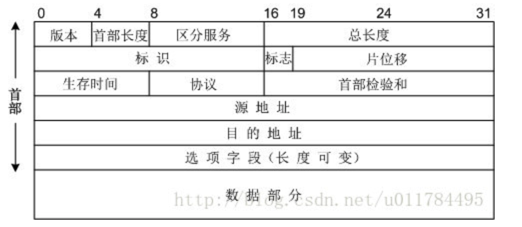

# 11 月第 3 周

## Javascript

## Typescript

## Node

### dgram

Node udp 协议

#### nc 命令

使用 nc 命令测试 upd 服务器

```
nc -u4 host port
```

### Console

```
const console = new Console(输出流，错误流);

例如 global.console 为 new Console(process.stdout,process.stderr);
```

### Node 异步实现及流程

#### 阻塞和非阻塞

在操作系统层面，无异步同步之分，只存在阻塞和非阻塞

- 阻塞：操作系统完成整个 I/O 操作才会返回数据，包括文件寻址，文件读取，复制到内存等等
- 非阻塞：操作系统读取文件后，在操作系统内部维护文件描述符（内部维护映射表），通过文件描述符来对文件进行操作

#### 异步机制

**轮询**：由于 I/O 是非阻塞的，所以无法知道何时 I/O 完毕，则需要一个轮询机制去判断 I/O 何时完毕，分为以下几种

- read
- select
- poll
- epoll：Linux 下效率的轮询机制，轮询时，如果未检测到 I/O 时间，则休眠，等待事件唤醒

#### Node 异步机制

Node 存在**主线程**和 **I/O 线程池**，主线程负责调度，I/O 线程池负责执行。且使用**请求对象**实现线程通信

主线程发起异步 I/O => 封装请求对象，并将参数和回调函数放入请求对象 => 推入 I/O 线程池 => 空闲 I/O 线程执行完毕后，将结果放入请求对象 => I/O 观察者 => 事件循环 => 主线程回调函数

- 在\*nix 中，Node 自身维护 I/O 线程池
- 在 windows 中，使用的时操作系统的 IOCP，本质也是线程池，但是维护在操作系统内部

### Node 事件循环

1. timer 阶段：负责 setTimeout 和 setInterval 执行
2. pending callback：负责上个 Tick 未执行完的 I/O 回调
3. idle,prepare：系统内部调用
4. poll：I/O 回调
5. check：setImmediate
6. close callback：一些关闭事件的除法，例如 socket.on('close',callback);

#### process.nextTick

由内部 nextTickQueue 队列维护，且完成每次操作时，清空 nextTickQueue（内部由数组维护）

#### setImmediate

由 check 观察者观察，且每次只会执行一个（内部由链表维护）

#### poll

**Node 事件循环主要操作**

事件循环执行，执行到 poll 时，如果此时存在任务队列，则连续执行任务队列，直到清空任务队列，如果不存在任务队列，**则在 poll 等待**，等待分两种情况

1. 在等待时，发现存在 setImmediate，则跳出 poll，进入 check 执行
2. 在等待时，发现 timer 即将结束，则跳出 poll，进入 timer 执行

#### timer 和 check

两个执行顺序

1. 在 I/O 操作后：一定是 check 先执行
2. 未在 I/O 操作后：执行无具体顺序，可能 timer 先，可能 check 先

### Node 的垃圾回收机制

Node 内存服从 V8 内存管理（Buffer/TypedArray 除外），一般来说 64 位为 1.4G，32 位 0.7G。Node 中内存主要分为新生代和老生代

#### 新生代

临时存储，存储易变的数据，一般来说是 32MB(16MB\*2)

新生代采用 **Scavenge 算法**：新生代空间由两部分组成，From 空间，To 空间，当进行 GC 时，将 From 空间存活的对象取出放入 To 空间，且交换名称。

特点：

1. 速度很快
2. 空间利用率较低

#### 老生代

长期存储，存储非易变数据

老生代采用**标记清除，标记整理**：对进入老生代且存活的对象进行标记，在 GC 时，清除不存在标记的数据；清除数据时，可能造成内存可使用不连续，利用率较低，所以需要将内存进行整理，将使用的内存区域整理到左边，将未使用的内存区域整理到右边

特点：

1. 速度慢
2. 空间利用率高

#### 步进

由于 Node 单线程特性，GC 时主线程无法执行，所以采用`步进`：主线程执行一会，GC 执行一会，交替执行

## C++

## 网络

### 网络层

#### 协议

- IP 协议：尽力而为协议
- ATM 恒定比特流协议：确保交互，延时确保，有序....
- ATM 可用比特流协议：在 IP 协议基础上增加了**有序**
- 路由转发协议：维护路由转发表，即**路由选择**
- 路由选择协议：路由如何选择传输节点（有点复杂，先放放）
- 网络控制报文协议：主要用于网络连接抛错

#### 传输

可靠传输：VC（虚拟电路），将端到端的所有节点连接，创建一条虚拟的电路，以供数据传输（类似打电话）
不可靠传输：数据报网络，利用路由转发来发送数据。例如 IP 协议

#### 路由器

1. 输入

   - 链路连接
   - 数据传递
   - 查找：根据源 IP 地址选择哪一条链路输出，使用**最长前缀匹配**（选择延时）

2. 交换

   输入和输出的交换

   - 内存交换
   - 总线交换
   - 互联网络交换

3. 输出 （**输出缓存，排队延时，分组丢失**）
4. 路由选择处理器(路由器 CPU)

#### IPV4

##### IPV4 报文



总共 20 字节，分为：

- 协议版本 4
- 报文长度
- 32 位（标识，标记，片偏移量）

  1. 标识：对于较大数据报，因为网络最大传输(MTU)限制，将数据报切分成**片**，路由器对于每个数据报编号，对于同一数据报的片，采用同一标识
  2. 标记：同一数据报的分片，最后一片为 0，其他为 1。主要是标识是否为最后一片
  3. 片偏移量：对于同一数据报，`片偏移量=字节流索引/8`，例如
     <font color="red">分片后，如果丢失其中分片，则网络层会丢弃该数据，不会交给传输层</font>

  ```
    4000字节，MTU为1500字节，最大数据则为1480（1500-20）字节

    0：0~1480，标识=X，标记=1，偏移量=0
    1480：1480~2960，标识=X，标记=1，偏移量为1480/8=185
    2960~4000：标识=X，标记=0，偏移量=2960/8=370
  ```

- 服务类型
- 协议：标识上层协议类型，6-TCP，17—UDP
- 32 位源 IP 地址
- 32 位目标 IP 地址
  ...

###### 地址分配

IP 一般采用`点10进制`表示，10.0.0.1

**前缀**
a.b.c.d/x，x 为前缀，表示前 x 位可表示 IP 地址，例如 10.0.0.0/8，则 10.0.0.0~10.255.255.255 视为同一地址

**分段**

1. 内网 192.168.0.0/16，10.0.0.0/8,172.16.0.0~172.31.255.255=>`[172.16.0.0,172.32.0.0)`
2. 255.255.255.255 向子网广播
3. 其他为公网

**组织地址分配**
一般是协会分配给某个组织 IP 段，例如 40.0.1.0/24,则代表该组织可以分配 40.0.1.0.0~40.0.1.0.255 给组织内部

#### IPV6

1. 128 位 IP 地址
2. 40 字节 字节头部（32 字节 IP 地址+8 字节其他）
3. 如果数据报过大，则会抛错而不是分片

#### 双栈

虽然 IPV6 解决了 IP 不够的问题，但是因为目前 IPV4 已经广泛使用，无法一次性全部替换，所以采用**双栈**，即同时支持 IPV4 和 IPV6，如果**同时支持 IPV6**，则使用 IPV6，否则使用 IPV4

**隧道模式 **

#### IP 获取

**管理员手动配置**

**DHCP（动态主机配置协议）**
当客户端进入网络时，自动向 DHCP 服务器请求，获取动态 IP 地址，步骤分为

1. DHCP 发现：客户端向 255.255.255.255 广播，等待 DHCP 服务器响应
2. DHCP 提供：DHCP 服务器向 255.255.255.255 广播，并带上信息，其中包括子网 IP，子网掩码，IP 有效时间等
3. DHCP 请求：客户端从接收到信息挑选一个，并向目标 DHCP 发送请求，带上挑选的信息
4. DHCP 确认：DHCP 确认该信息

#### 网络地址转换（NAT）

**内网地址向外网地址转换**

主机 A（`内网IP`+端口） => 路由器（修改为`外网IP`+路由器随机端口） => ... =>主机 B

主机 B => ... => 路由器（通过 NAt 表，将`目的IP和端口`设置为主机 A 的`内网IP`+端口）=> 主机 A

#### 安全协议 IPsec

## 算法

## 摘要算法

### hash

哈希算法，使用散列函数转为摘要的算法，也称为摘要算法

特点：

1. 散列函数具有确定性，相同内容转换为摘要相同
2. 散列函数输入、输出不对等性，相同摘要内容不一定相同

常用类型：

1. md5：以 md4 推演而来，过程不可以，总长为 128 位
2. sha1：也是根据 md4 推演而来，较 md5 长，总共为 160 位
3. sha2：是一个集合，通常使用 sha-256

#### hmac

带秘钥的 hash

### 单词查找树

#### R 向单词查找树

**R 向查找树，空间消耗巨大**
**R 向单词树**，R 为可能的字符数量，如小写字母表，则 R = 26。每一层都已 R 位数组来存储所有可能的字符，查找时一层层查找，如下所示

例如：R = 4,表示 abcd

```
[
  [ '',
    [ '', '',
      [ '', '', '', 1 ],
      '',
    ], '', '',
  ], '', '', '',
]
// 第一层占a位置，2层占b位置，3层占c位置，4层占d位置（只表示最后一位的位置 **1**）

interface Word {
  value?: number; // 代表当前节点是否结束，结束则大于0
  next?: Array<Word>;
}

class WordTree {
  private R: number;
  private root: Word;

  constructor(r: number) {
    this.R = r;
    this.root = {
      value: 0,
      next: new Array(r),
    };
  }

  /**
   * appendString
   * str:string
   */
  public appendString(str: string) {
    let pre: Word = this.root;

    for (const s of str) {
      const code = s.charCodeAt(0) - 'a'.charCodeAt(0);
      if (!pre.next[ code ]) {
        pre.next[ code ] = {
          value: 0,
          next: new Array(this.R),
        };
      }
      pre = pre.next[ code ];
    }
    // 结束时，需要将末尾的pre value置为1
    pre.value = 1;
  }
}
```

#### 三向三次查找树

和 3-节点树类似，假设字符串 ab ac ad

节点 A: left 节点 C，mid 节点 B，right 节点 D

## Leetcode

### 最长回文字符串

思路 1：暴力法
思路 2：动态规划，最左和最右必须相等，且内部必须为回文字符串，推导公式为：P(i,j) = P(i-1,j-1) && s[i] === s[j];

```
/**
 * @param {string} s
 * @return {string}
 * f(i,j) = f(i-1,j-1) && s[i]===s[j]
 */
const longestPalindrome = function (s) {
  if (!s) return '';
  const len = s.length;
  const arr = [];
  let n = 2; // 寻找3，4，5...字母回文
  let max = 1;
  let maxStr = s[ 0 ];

  // 初始化 1字母回文和2字母回文

  for (let i = 0; i < len; i++) {
    !arr[ i ] && (arr[ i ] = []);
    arr[ i ][ i ] = 1; // 单字母回文

    if (s[ i ] === s[ i + 1 ]) { // 双字母回文
      arr[ i ][ i + 1 ] = 2;
      max = 2;
      maxStr = s.slice(i, i + 2);
    }
  }

  while (n < len) {
    for (let i = 0; i < len; i++) {
      if (s[ i ] === s[ i + n ] && arr[ i + 1 ][ i + n - 1 ]) {
        const m = arr[ i + 1 ][ i + n - 1 ] + 2;
        arr[ i ][ i + n ] = m;
        if (m > max) {
          max = m;
          maxStr = s.slice(i, i + n + 1);
        }
      }
    }
    n++;
  }
  return maxStr;
};
```

思路 3：中心扩散

```
/**
 * @param {string} s
 * @return {string}
 * f(i,j) = f(i-1,j-1) && s[i]===s[j]
 */
const longestPalindrome = function (s) {
  if (!s) return '';
  const len = s.length;
  // 中心扩散，找到每个中心，向左右扩散，中心扩散优化，**只以单字母或重复字母新扩散**
  const l = [];
  let i = 0;
  let max = 0;
  let maxStr = '';

  // 寻找中心，以[l,r]表示左右
  while (i < len) {
    let j = i + 1;
    while (s[ j ] === s[ i ]) {
      j++;
    }
    l.push([ i, j - 1 ]);
    i = j;
  }

  // 以l,r向左右扩散
  for (let item of l) {
    let [ x, y ] = item;
    while (x > 0 && y < len - 1 && s[ x - 1 ] === s[ y + 1 ]) {
      x--;
      y++;
    }

    const n = y - x + 1;
    if (n > max) {
      max = n;
      maxStr = s.slice(x, y + 1);
    }
  }
  return maxStr;
};
```

[最长回文子串](https://leetcode-cn.com/problems/longest-palindromic-substring/solution/zui-chang-hui-wen-zi-chuan-by-leetcode/)
