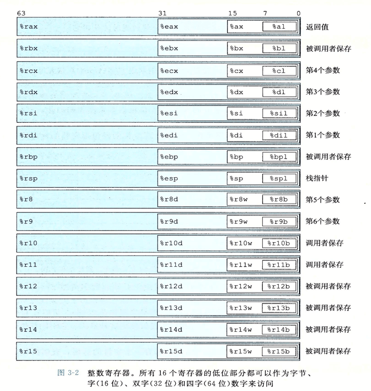
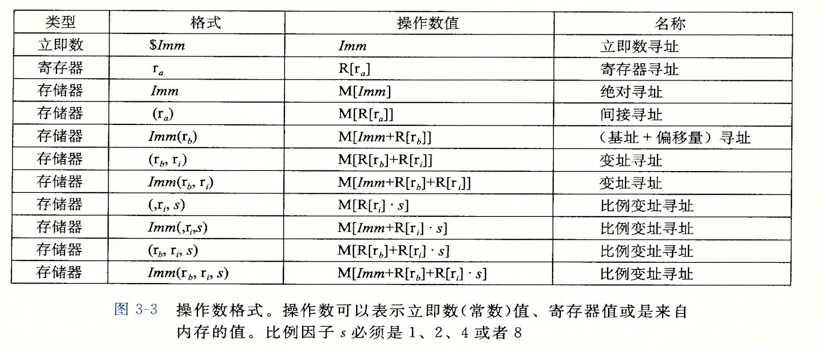
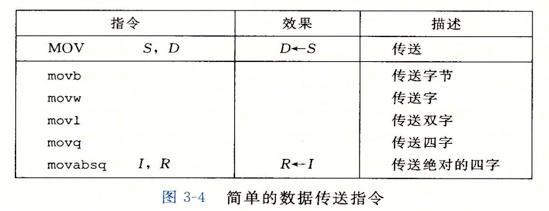
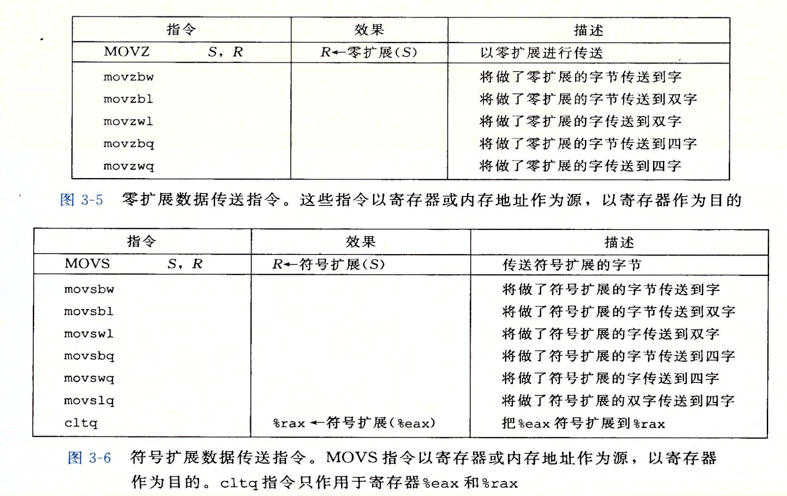
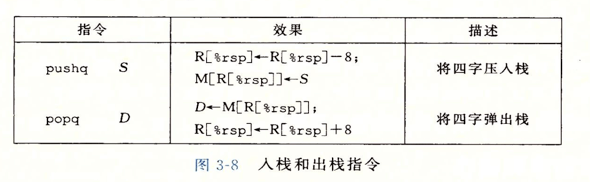
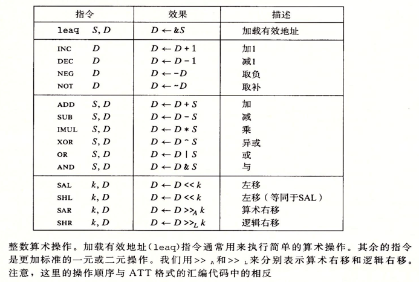

# 9 月第三周

## Javascript

### Object.fromEntire

在 `ES10` 中增加新的方法 `Object.fromEntires`，与 `Object.entires` 对应

```
Object.entires(object);
Object.fromEntires(iterable);

const obj = { name: 'name', age: 'age' };
const arr = Array.from(Object.entries(obj)); // 返回可迭代结构
console.log(arr);
console.log(Object.fromEntries(arr)); // 返回对象
```

[MDN - Object.fromEntries](https://developer.mozilla.org/zh-CN/docs/Web/JavaScript/Reference/Global_Objects/Object/fromEntries)

### Shadow DOM

隐藏 DOM，类似于 Video 标签，你无法查看 Video 内部元素，现在呢 Shadow DOM API 也支持元素的隐藏即显示

- closed 时：DOM API 无法对元素内部操作
- open 时，可以操作

```
const sr = ELement.attachShadow({ mode: open / closed, delegatesFocus: true / false });

sr.innerHTML = "";
sr.appendChild("<div></div>");
```

1. 当使用 attachShadow 时，原 ELement 部分 DOM API 不会生效，例如 innerHTML，在开发者模式下查看，innerHTML 添加了文本节点，但是未显示在页面上
2. 可以使用 shadowRoot 操作 DOM，如 innerHTML、appendChild、getElementById
3. 只有在 open 时可以通过 ELement.shadowRoot 去访问内部（此时 Element.shadowRoot === sr），但 closed 时无法访问
4. 一直都可以使用 sr 访问及操作

### Javascript 引擎（V8）

后续了解 node 源码时才了解，没有理解到

### Form javascript 原生验证

### centos 6.10 部署 nest.js gRPC 报错

1. nest.js 部署 grpc 服务时，因为 centos 6 版本过低，linux 内核版本较低，致使无法绑定端口
2. 本想使用 dokcer 部署，但 `docker pull ubuntu1:6.04`时，镜像的 linux 内核跟随当前系统，而非 ubuntu1:6.04 自身的内核
3. 在无法解决的情况下，更换 centos7 部署成功

## c++

### math 模块 max、min

```
#include <math.h>
using namespace std;
// 使用 min ,max 来比较两数大小
```

### sort

```
#include <algorithm>
using namespace std;

sort(start,end,compare_function)

如 int arr[10]排序：sort(arr,arr+10,less<int>());

compare_function std 提供：
- less
- less_equal
- greater
- greater_equal
- equal_to
- not_equal_to
```

## CSAPP

### 寄存器

#### 16 个通用寄存器



### 数的计算

1. 立即数 以 \$ 为标记的数，如 `$10` 即为常数
2. 从寄存器取数 `%rax`
3. 从内存取数 `(%rax)` %rax 中保存的内存地址的值

### 寻址

1. 寄存器寻址

2. 内存寻址



### 数据传输指令

```
movb 半字指令
movw 1字指令
movl 2字指令
movq 4字指令

如  movq %rax %rdi
```

**指令的字数必须与寄存器地址保持一致**



#### 扩展拷贝数据指令



### 入栈、出栈指令



### 算术运算、逻辑运算指令



```
如 incq %rax
   add1 %2 $rax
```

#### 一元、二元操作指令

```
++ : incq %rax

+= : add1 %2 $rax
```

## leetcode

### 盛水最多的容器

[盛水最多的容器](https://leetcode-cn.com/problems/container-with-most-water/submissions/)

思路：双指针

1. 头指针指向*第 0 位*，尾指针指向*最后一位*
2. 计算出水位，移动高度较小的指针，始终保持高度较大的指针用于计算水位
3. 移动指针时，如果计算的值大于最大值，则替换最大值
4. 当头尾指针相遇，则循环结束，返回最大值

```
int maxArea(vector<int>& height) {
      if (height.size() < 2) return 0;

      int max_height = 0;
      int i = 0, j = height.size() - 1;

      while (i < j) {
        max_height = max(max_height, (j - i) * min(height[i], height[j]));
        height[i] < height[j] ? i++ : j--;
      }
      return max_height;
    }
```

### 整数转罗马数字

[整数转罗马数字](https://leetcode-cn.com/problems/integer-to-roman/)

设: 数字为 n,计数器 i,返回字符串 s

思路 1：从数的低位计算

1. 将所有罗马数字存储 { 1:'I', 5:'V'... }
2. 取末尾数字 l = n % 10；n /= 10（整除）
3. 判断 l \* (10^i) 是否 在 存储表中有匹配，有匹配则直接将字符串联合；否则进入下一次循环,无匹配则进入下一阶段
4. 判断 l 是否大于 5，如果大于 5，则匹配 (l-5) \* (10^i) + 5 \* (10^i)；否则直接匹配 l \* (10^i)，联合字符串，进入下一次循环

思路 2：从数的高位计算

设：数字 n,字符串 s

1. 存储 罗马字符和数字的匹配关系，roman_str = [ 'I','V'... ]; nums = [ 1,5.... ];
2. 循环数字存储（从数值大的递减向数值小的，此处应该是从前往后循环）
3. 如果当前数大于 nums[i]，则 s += _该数对应的罗马字符串_，n -= nums[i]；否则 i++
4. 直到 n 归 0

```
string intToRoman(int num) {
  int values[] = {1000, 900, 500, 400, 100, 90, 50, 40, 10, 9, 5, 4, 1};
  string reps[] = {"M",  "CM", "D",  "CD", "C",  "XC", "L",
                   "XL", "X",  "IX", "V",  "IV", "I"};

  int i = 0;
  string s = "";

  while (i < 13 && num > 0) {
    if (num >= values[i]) {
      num -= values[i];
      s += reps[i];
    } else {
      i++;
    }
  }
  return s;
}
```

### 三数之和

思路 1：将三数之和拆分为两数之和

设：数组为 nums,

1. 将数排序，从第 i 位去出一个数，然后改问题分解为从剩余的数找出两个数，其和为 0 - nums[i];
2. 但是这里的两数和存在个问题，如果按照 **两数和** 来求解，可能会出现重复值，如 [-1,2,-1],[-1,-1,2]
3. 所以，这里的两数和采用双指针法，头指针指向 j = i+1,尾指针指向末尾 l
4. 如果双指针和 为 0，则正确，返回该结果，且 j++,l--；如果和 < 0,则 j++；否则 l-- （这边有个很重要的地方，就是在 j++,或者 l--时，必须跳过重复值）
5. 直到 nums[i] 的值为 0 时，可以终止循环了，因为三个正数的值不可能为 0

```
vector<vector<int>> threeSum(vector<int>& nums) {
  int size = nums.size();
  vector<vector<int>> new_nums;
  sort(nums.begin(), nums.end());

  for (int i = 0; i < size; i++) {
    if (nums[i] > 0) break;
    if (i > 0 && (nums[i] == nums[i - 1])) continue;

    // 找出剩余两数和为 0 - nums[i];
    int v = 0 - nums[i];
    int j = i + 1, l = size - 1;

    while (j < l) {
      if (nums[j] + nums[l] == v) {
        new_nums.push_back({nums[i], nums[j], nums[l]});
        j++;
        l--;
        while (nums[j] == nums[j - 1] && j < l) {
          j++;
        }
        while (nums[l] == nums[l + 1] && l > j) {
          l--;
        }

        // 数值大了，需要减小点
      } else if (nums[j] + nums[l] > v) {
        l--;
        while (nums[l] == nums[l + 1] && l > j) {
          l--;
        }
        // 数值小了，需要增大些
      } else {
        j++;
        while (nums[j] == nums[j - 1] && j < l) {
          j++;
        }
      }
    }
  }
  return new_nums;
}
```
