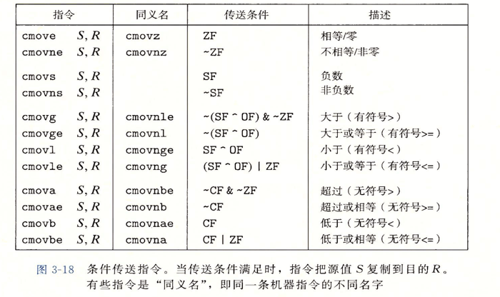
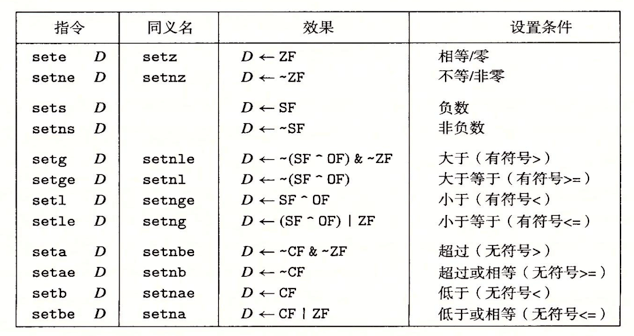
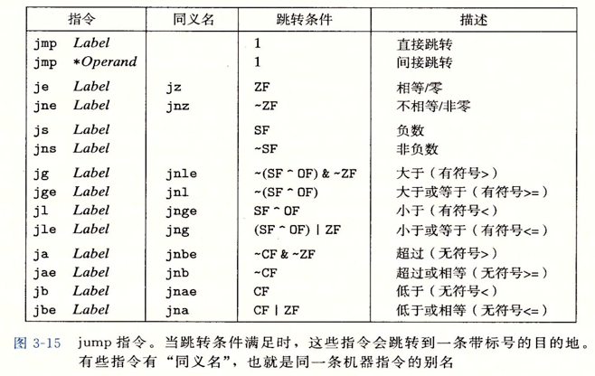

# 9 月第四周

## Typescript

### 声明空间

**类型声明空间**

类型声明空间用作类型注释，如下所示

```
type type_namespace
interface type_namespace
class type_namespace
```

**变量声明空间**

变量声明空间用作值，如下所示

```
var/let/const value_namespace;
class value_namespace;
```

存在特声明 `class` 即可当做类型声明空间，也可当做变量声明空间，但是，如果 class 赋值后，即确认被当做值使用了，就不能当做类型注释了，如下所示

```
class A {};
const B = A;
const b:B // 不能这样使用
```

### 类型

#### Javascript 基本类型

- string
- number
- boolean
- symbol

虽然 null、undefined 也是基本类型，但是在 ts 中有特殊意义，所以在特殊类型中解释

#### object

object：对应 Javascript 中的 Object，表明是一个对象，但是该表明无法表示对象内部拥有的属性、方法，平时用的不多

#### 内联类型

较为常用的一种方式，直接声明对象内部存在的属性、方法

```
const a:{name:string} = { name: 'Test' };
```

#### 枚举

枚举，声明一个常量集合。一般分为 数字枚举、字符串枚举、异构枚举、常量枚举

- 数字枚举：枚举值为数字，如果为指出枚举值，则从 0 开始递增
- 字符串枚举：枚举值为字符串，必须显示的指出字符串的值
- 异构枚举：枚举值即含数字，又含字符串
- 常量枚举：以 `const` 声明的枚举

常量枚举：其他一般的枚举，在编译为 JS 代码时，会被编译为一个对象，如下所示：

```
enum A { ONE };
const a:A = A.ONE;
// 编译为
var A;
(function(A){
  A[A[0] = "ONE"] = 0;
})( A || ( A = {}));
var a = A.ONE;
```

而常量枚举是不会编译的，但是在你使用时，会直接转换为常量，所以常量枚举性能较高

```
const enum A { ONE };
const a:A = A.ONE;
// 编译为
var a = 0;
```

#### interface

interface：接口既可以做为类型，也可以用类去实现

**普通接口**

```
interface A {
  name:string;
  name?:string;
  readonly name: string;
}
```

**索引接口**

```
interface A{
  [index:number]:string;
}
```

**函数接口**

```
interface A{
  (i:number,j:number):number;
}
```

**类实现**

```
interface A {};
class B implements A{}

// 当然一个类可以实现多个接口
class B implements A,C,D {}
```

但是，并非所有接口都可以很好的实现，如下所示，虽然实现了接口，但 constructor 返回值为 `new B()` 的值，而非是 B 类的实例

```
interface A{
  new():{ name:string };
}

class B implements A {
  constructor(){
    return {name: 'Test'};
  }
}
```

#### type

类型别名，可以使用 type 来指定类型或类型别名

```
type A = {
  name: string,
  age: number,
};

type A = number;
```

#### 联合类型、交叉类型

联合类型：表明可能是多种类型中的一种
交叉类型：表明该类型全部符合

```
type A = string | number; // 联合类型，表明可能是string，可能是number
type A = string & number; // 交叉类型，表明既是 string，又是number
```

#### 特殊类型

- null、undefined：和 JS 原生 null、undefined 差不多，但在 TS 中，null、undefined 是所有类型的子类型（never 除外），可以向其他类型赋值（never 除外，且 strictNullChecks=false）。如果 strictNullChecks=true，则只能向自身赋值了。但还是存在特殊情况，undefined 可以向 void 赋值，估计是因为 JS 函数的关系，因为函数默认返回值为 undefined
- any：任意类型，表示当前值不需要 TS 类型检查，什么都可以
- void：没有任何类型，一般用于函数当中
- never：不存在值或永远不会发生，never 也用于函数的返回值，且任何类型都不能赋值给 never，除了 never

#### 字面量类型

使用字面量来作为类型，使用的较少，如下所示

```
const a: 'HELLO WORD' = 'HELLO WORD';
const a : 1 = 1;
const a : false = false;
```

#### 流动类型

使用 typeof 来做类型注释，如下所示

```
type A = number | string; // 联合类型
const a:A = 2; // 类型推断，此时 a 是数字类型
const c :typeof a = 2; // 根据a的类型来设置c的类型
```

#### 类型保护

类型保护：当使用联合类型或者 any 时，调用某个特定的方法或者属性，需要对类型进行判断，防止抛出错误

#### 类型断言、类型推断

类型断言：程序员指出值的类型，覆盖掉类型推断。分为 `as type` `<type>` 两种使用方式，但是在 JSX 中只能使用 `as` 断言  
类型推断：程序根据上下文推断出值的类型

### 声明文件

声明文件：声明 TS 类型及依赖的文件，譬如说经常看到的 \*.d.ts 文件

**index.d.ts**

一般放置于 npm 包根目录，声明当前包的类型及依赖

**@types**

放置于 node_modules/@types 下，也是用于声明包的类型及依赖

**lib.d.ts**

可以放在项目根目录，也存在 typescript 目录下的 lib/\*.lid.d.ts，可以在 `tsconfig.json` 中禁用

**global.d.ts**

全局声明

**typescript 模块和声明文件理解不深，后续需要仔细研究下**

### 模块

#### 全局模块

全局模块和全局变量一样，在任意处都可以访问，例如 node 中的 global ，不需要导入即可使用，而非全局模块中声明的，必须导入后才能使用。例如可以在 `global.d.ts` 中声明

#### 文件模块

必须在文件中导入才能使用，使用的是 `import、export` 语句，例如 `import * as fs from 'fs'`。import、export 用法整体和 ES 模块用法类似，且 import 语句实际做了如下：

1. 导入文件模块的类型信息
2. 确定文件模块运行时的依赖关系

**module**
可以在 tsconfig.json 内设置编译后的模块类型

```
"module": "system", // 'none', 'commonjs', 'amd', 'system', 'umd', 'es2015', or 'ESNext'
```

**路径解析**

```
"moduleResolution": "node"  // 'node'、'classic'
```

选择的是 node 模式来解析路径，没有使用过 classic

[node 模块路径解析](../../note/backend/node模块路径解析.md)

## c++

### define

```
# define A 10

int main(){
  int a = A;
}
```

使用 define 定义后，程序内可以直接使用该值 （宏，可以直接替换掉程序内部的使用，而非调用，类似内联函数的使用方式），但需要注意的是，define 声明后没有类型，使用时需要指定类型

### union

联合类型：存储不同的数据类型，但同时只能存储一种类型。且联合类型的长度为 存储类型长度的最大值。因为联合类型是一段连续的存储空间 ，所以不能定义对象、引用类型等

```
union Test {
  char t1;
  int t2;
  long t3;
  double t4;
};

Test t;
t.t1  = 2;
```

## CSAPP

### 移位

移位指令要么移动常量位数，要么使用寄存器 %cl（只能使用%cl 寄存器）


### 特殊运算

增加对 128 位运算的支持，例如：64 位数 \* 64 位数

### 条件

条件指令分为 CMP TEST



### 跳转指令



### 返回指令

ret == retq // 常用指令
rep == repz

### 循环

循环无直接对用的汇编，是使用跳转语句实现的，可以使用 goto 语句来理解

### 过程

过程主要包含三种操作：

1. 转移控制
2. 传递参数
3. 分配、释放内存

#### 转移控制

```
call Q
movq %rbx,%rax
...
```

执行到 call Q 时，将 Q 过程的起始指令位置放入 PC，且将 call Q 后续的一个指令`movq %rbx,%rax`压入栈中，等待 Q 执行完毕后，将`movq %rbx,%rax`弹出，放入 PC，继续执行

#### 传递参数

寄存器按照调用者是否能操作分为：调用者保存，被调用者保存，栈

- 调用者保存：调动函数可以修改，存储的寄存器，在执行前需要被调用者准备好数据，例如传参
- 被调用者保存：被调用者即将使用或可能使用的寄存器，调用者无法修改内部数据
- 栈：栈寄存器

在调用时，会将参数放置于 6 个参数寄存器中（参数寄存器属于调用者保存寄存器），如果参数多余 6 个，则只能存放于栈中

#### 分配、释放内存

当函数遇到如下情况时，需要开启内存存储空间：

1. 寄存器空间不足
2. 使用数组、结构体等
3. 使用 "&" 运算符
4. 函数参数过多

此时函数会申请内存空间，在函数调用完成后释放内存空间

#### 递归

特殊函数调用，调用自身，汇编指令为 函数内部 `call 自身`，因为过程会保存自身的状态，所以可以实现

### 数组、结构体、共同体

1. 以连续空间存储数据
2. 以标记标识第一个存储地址

### 数据对齐

方便计算机更快的读取数据。举个栗子，如果计算自一次性读取 8 字节（64 位）的数据，如果一条数据正好为 8 字节，且按照 8 字节对齐存储，则计算机读取一次则可以读取到完整数据；如果按照 4 字节对齐，则可能需要读取两次才能读取完整数据

### 内存越界、缓冲区溢出

防止栈被黑客入侵，操作系统采取了如下措施：

1. 栈随机化
2. 栈破坏检测
3. 限制可执行代码

后续准备看安全的书籍在理解这个，目前只是初略看了看，有点迷糊

## 算法

### 查找

**无序查找**

存储时无序存储，查找时遍历整个数据查找

**有序查找**

存储时有序存储，查找时取头部或尾部

#### 二叉树查找

保证`左子节点小于父节点，右子节点大于父节点`

查找：

- 最大值：根节点->右子节点->右子节点->右子节点...
- 最小值：根节点->左子节点->左子节点->左子节点...
- 其他节点：二分法查找

插入：

- 插入：二分法查存到适当位置，插入即可

删除：

- 删除叶节点：直接删除
- 删除非叶节点：如果该节点存在右子节点，则从右边选择最小的节点来替代；如果不存在右子节点，则从左边选择最大值来替代

优点：

1. 查询速度和存储速度都较快

缺点：

1. 查询效率和树的深度有关
2. 树的深度和输入数据的顺序有关，如果顺序不好，如*从小到大输入，树全部为右子节点，无法使用二分法加快查找效率*

#### 平衡二叉查找树（2-3 节点数）

改进二叉查找树，采用平衡二叉查找树，保证`节点左边的深度和右边的深度相差不大于1`

采用普通额二叉查找树，且保持平衡的话，在`插入操作时消耗过大，太为复杂，需要频繁的旋转树`，所以采用 2-3 节点树来保证平衡

查找：

- 最大值：根节点->右子节点->右子节点->右子节点...
- 最小值：根节点->左子节点->左子节点->左子节点...
- 其他节点：二分法查找，需要注意的是，3-节点需要比较中间值

插入：

- 插入 2-节点：直接插入，变为 3-节点
- 插入 3-节点：
  1. 先直接插入，变为 4-节点
  2. 将 4-节点中间节点提升为父节点，拥有左子节点，右子节点（左子节点，右子节点就是 4-节点的左、右节点）
  3. 将提出的父节点与原来非父节点合并，看成插入操作，进入**插入操作第一步骤**
  4. 直到根节点

删除：

- 删除叶节点：直接删除
- 删除 2-非叶节点：如果该节点存在右子节点，则从右边选择最小的节点来替代；如果不存在右子节点，则从左边选择最大值来替代
- 删除 3-非叶节点：如果该节点为左节点，则将该节点看做**左子节点、中间子节点的 2-节点**进行删除；如果是右节点，则将该节点看做**中间子节点、右子节点的 2-节点**进行删除

优点：

1. 保证树的平衡，查询速度和存储速度都较快
2. 插入时不需要复杂的旋转操作
3. 不依赖输入数据的顺序

缺点：

1. 存在 3-特殊节点，判断条件较多，不管时插入时还是删除时

#### 红黑树

为了减少复杂的判断条件，对 2-3 平衡二叉树进行优化，采用红黑树。

红键：红键链接两个特殊的节点（其实就是 3-节点）
黑键：普通的 2-节点

红黑树的特点：

1. 红键只存在于树的左边，且任意一个节点只能链接一个红键
2. 黑键可以存在任意处

查找：

- 最大值：根节点->右子节点->右子节点->右子节点...
- 最小值：根节点->左子节点->左子节点->左子节点...
- 其他节点：二分法查找

插入：

插入键为红键，由于红键的特性，分为如下情况

- 插入 右键为红键，左键为黑键：左旋
- 插入 左键为红键、左键的左键也为红键：右旋
- 插入 左键右键同时为红键：颜色转换，左键右键同时转为黑色，父键转为红色

左旋：将该节点与该节点的右子节点交换位置，*右子节点的左子节点*成为*该节点的右子节点*
右旋：将该节点与该节点的左子节点交换位置，*左子节点的右子节点*成为*该节点的左子节点*

## LeetCode

### 电话号码的字母组合

思路：

1. 将输入数字两两分组，分别组合，得到新的多个组合
2. 不断将内部两两组合，直到剩余最后一组即可

```
vector<string> letterAttach(vector<string> v1, vector<string> v2) {
  vector<string> v_new;
  for (int i = 0; i < v1.size(); i++) {
    for (int j = 0; j < v2.size(); j++) {
      v_new.push_back(v1[i] + v2[j]);
    }
  }
  return v_new;
}

vector<string> letterCombinations(string digits) {
  vector<vector<string>> string_dict = {
    {"a", "b", "c"}, {"d", "e", "f"},
    {"g", "h", "i"}, {"j", "k", "l"},
    {"m", "n", "o"}, {"p", "q", "r", "s"},
    {"t", "u", "v"}, {"w", "x", "y", "z"}
  };
  vector<vector<string>> store_string;
  vector<vector<string>> new_store_string;
  int len = digits.size();

  for (int i = 0; i < len; i++) {
    if (digits[i] < 50) continue;
    store_string.push_back(string_dict[digits[i] - 50]);
  }

  len = store_string.size();
  while (len > 1) {
    new_store_string.clear();
    for (int i = 0; i < len / 2; i++) {
      new_store_string.push_back(
          letterAttach(store_string[2 * i], store_string[2 * i + 1]));
    }
    if (len % 2 != 0) new_store_string.push_back(store_string[len - 1]);
    store_string = new_store_string;
    len = new_store_string.size();
  }

  return store_string[0];
}
```

[电话号码的字母组合](https://leetcode-cn.com/problems/letter-combinations-of-a-phone-number/submissions/)

### 删除链表的倒数第 N 个节点

思路：快慢指针

```
ListNode* removeNthFromEnd(ListNode* head, int n) {
  ListNode* last = head; // 尾指针
  ListNode* prev = nullptr; // 头指针的前一位

  while (n > 0) {
    last = last->next;
    n--;
  }

  while (last != nullptr) {
    last = last->next;
    prev = prev == nullptr ? head : prev->next;
  }

  // 删除头节点
  if (prev == nullptr) {
    return head->next;
  }

  // 删除普通节点
  prev->next = prev->next->next;
  return head;
}
```

### 删除排序数组中的重复项

思路 1：hash 表，但是题目中不允许使用额外空间，则 hash 表不满足
思路 2：快慢指针，慢指针指向交换的位置，块指针指向不重复的元素

```
int removeDuplicates(vector<int>& nums) {
    if (nums.size() <= 1) return nums.size();
    int i = 1;  // 慢指针
    int j = 1;  // 快指针

    while (j < nums.size()) {
      if (nums[j - 1] != nums[j]) {
        nums[i] = nums[j];
        i++;
      }
      j++;
    }
    return i;
  }
```

[删除排序数组中的重复项](https://leetcode-cn.com/problems/remove-duplicates-from-sorted-array/)

### 买卖股票的最佳时机 II

思路 1：

1. 如果手上没有股票，今天比明天低则买入，否则跳过
2. 如果手上有股票，今天比明天高，则卖掉

思路 2：

1. 如果今天的比昨天价格高，则假定买，肯定有收益
2. 如果今天比昨天的价格低，则假定不买

```
int maxProfit(vector<int>& prices) {
  if (prices.size() <= 1) return 0;
  int sum = 0;
  for (int i = 1; i < prices.size(); i++) {
    if (prices[i] > prices[i - 1]) {
      sum = sum + prices[i] - prices[i - 1];
    }
  }
  return sum;
}
```

[买卖股票的最佳时机 II](https://leetcode-cn.com/problems/best-time-to-buy-and-sell-stock-ii/solution/)

### 旋转数组

思路 1：
设：旋转长度 n

1. 如果 n 超过数组长度，则取余，如果余数为 0，则不旋转返回
2. 移动一格，n--，直到 n=0

思路 2：
设：旋转长度 n

1. 如果 n 超过数组长度，则取余，如果余数为 0，则不旋转返回
2. 叫数组反转，如 [1,2,3,4] => [4,3,2,1]
3. 将反转后的数组前 n 个再次反转，反转数组剩余再次反转，则得到旋转 n 的值，如 n=2 时，[4,3]=>[3,4];[2,1]=>[1,2]得到 [3,4,1,2]

```
void rotate(vector<int>& nums, int k) {
  int len = nums.size();
  if (len <= 1) return;
  k = k % len;

  for (int i = 0; i < len / 2; i++) {
    int s = nums[i];
    nums[i] = nums[len - 1 - i];
    nums[len - 1 - i] = s;
  }

  for (int i = 0; i < k / 2; i++) {
    int s = nums[i];
    nums[i] = nums[k - 1 - i];
    nums[k - 1 - i] = s;
  }

  for (int i = 0; i < (len - k) / 2; i++) {
    int s = nums[i + k];
    nums[i + k] = nums[len - 1 - i];
    nums[len - 1 - i] = s;
  }
}
```

[旋转数组](https://leetcode-cn.com/problems/rotate-array/)
