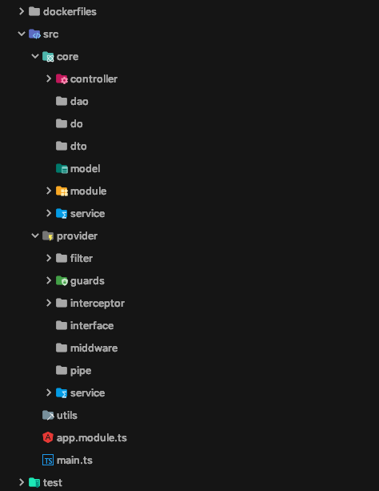

## 为什么使用 Nest

- 完美支持 typescript（为何要使用typescript）
- 生态良好，支持express 和 fastify 两种框架
- 面向AOP编程
- 尝试其他 node 企业级框架，原来用的 egg.js

## Nest 初始化及项目目录改造

### 使用 Nest CLI 构建项目

```
$ npm i -g @nestjs/cli
$ nest new project-name
```

### 项目目录拆分



### 简单架构图


## 基础配置

### 环境变量

- 引入 dotenv 包，读取根目录 .env 文件，由 `main.ts` 维护
- .env 文件不提交到 git 仓库，仓库存储为 .env-example 文件，在开发环境下由开发人员重命名为 .env 文件，读取开发配置
- 测试、正式环境的 .env 文件统一仓库维护，在启动工程前自动向配置仓库拉取，放置于根目录下

### 日志

- 引入 winston 包，由 `src/provider/service/log.service.ts` 维护
- 日志目录由 LOG_PATH 环境变量维护，开发环境为项目目录，测试、生产环境由 `Dockerfile ENV LOG_PATH` 指定
- 日志按天切割，日志格式为 `YYYY-MM-DD HH:mm:ss [${level}] ${message}` [(winston 如何切割日志)](winson打印日志.md)

### 认证

- 由 `src/provider/guards/auth.guards.ts`维护
- 根据传递 token 查询 redis，未登录则抛出 401，否则进入下一步骤

### 安全

- 引入 csurf 包防御 CSRF
- 引入 helmet 包防御 其他普通攻击，例如 XSS

### 缓存

- 由 `src/provider/interceptor/http.cache.interceptor.ts` 维护
- 缓存指定资源，存储于 redis 中(使用 nest 自带 CacheInterceptor)
- 自定义缓存key值，根据 请求参数和请求用户来缓存数据

## 数据库

- 引入 redis 包，由 `src/provider/service/redis.service.ts` 维护
- redis 保存用户 token, 在认证层校验
- redis 保存用户 get 请求数据，在缓存层维护

## gRPC

gRPC 远程调用 go 微服务

## GraphQL

后续提供 GraphQL

## 部署

- 使用 node:10-apline 镜像构建 node docker 镜像
- 镜像名称为 $npm_package_name, 版本为 $npm_package_version  
[node 构建docker镜像](node-docker构建.md)
