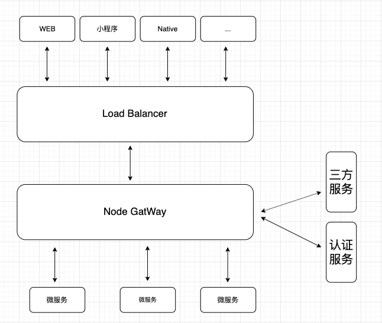

## 为什么使用 Nest

- typescript 友好
- 生态良好，工具开箱即用，例如如 GraphQL 和 gRPC
- 尝试其他node企业级框架，原来用的 egg.js

## Nest 初始化及项目目录改造

### 使用 Nest CLI 构建项目

```
$ npm i -g @nestjs/cli
$ nest new project-name
```

### 项目目录拆分


### 简单架构图



## 基础配置

### 环境变量

- 引入 dotenv 包，读取根目录 .env 文件，由 `src/provider/service/config.service.ts` 维护
- .env 文件不提交到 gitlab 仓库，仓库存储为 .env-example 文件，在开发环境下由开发人员重命名为 .env 文件，读取开发配置
- 测试、正式环境的 .env 文件统一维护，在启动工程前自动向配置仓库拉取，放置于根目录下

### 日志

- 引入 winston 包，由 `src/provider/service/log.service.ts` 维护
- 日志目录由 LOG_PATH 环境变量维护，开发环境为项目目录，测试、生产环境由 `Dockerfile ENV LOG_PATH` 指定
- 日志按天切割，日志格式为 `YYYY-MM-DD HH:mm:ss [${level}] ${message}` [(winston如何切割日志)](../tools/winson打印日志.md)

### 认证


### 安全


### 缓存


## 数据库

暂时不连接数据库

## gRPC

gRPC远程调用 go微服务

## GraphQL

GraphQL 提供服务

## 部署

> 
