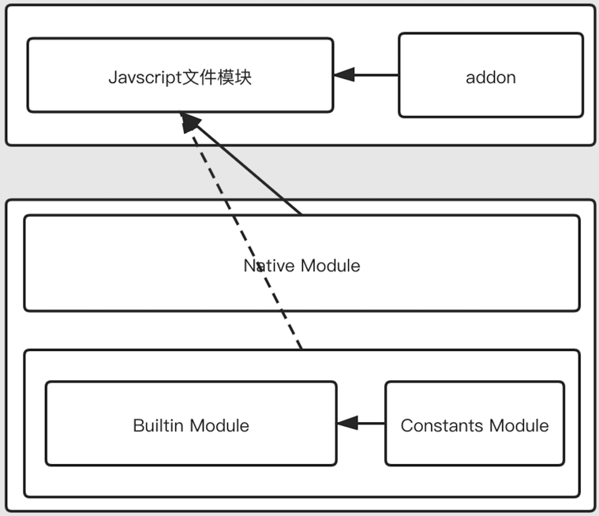

**Node 版本为 v10.16.0**

## 模块分类

Node 模块一般分为 4 类：

1. Builtin Module: 由底层 C++形式提供的模块，通常用户不会直接调用。例如 node_file.cc（fs）,node_os.cc（os）
2. Constants Module: 常量模块，定义于 node_constants.cc。例如文件打开常量 O_RDONLY（只读），O_WRONLY（只写）
3. Native Module: Node 标准模块，以 Javascript 形式提供的模块，用户调用的模块，Native Module 实现时，也会调用 Builtin Module 来实现其功能。例如 fs.js（fs）,os.js（os）
4. 文件模块: 用户自身的代码文件或三方包，主要分为以下三种
   - \*.js: 以 Javascript 形式提供的文件
   - \*.json: 以 JSON 形式提供的文件
   - \*.node: node 扩展，例如 c++ addon



## 模块生成

### Builtin Module

Builtin Module 源码在 _src_ 目录下，在编译生成可执行文件时，嵌入 ELF 格式（可执行可链接文件）的二进制文件 node 中。

后续按照**Module 定义、Module 存储、Module 挂载**来介绍 Builtin Module 的生成步骤，且将模块挂载生成分为两个步骤: **预挂载**（调用 `node::RegisterBuiltinModules()` 前） 以及 **挂载** （调用`node::RegisterBuiltinModules()`后）

tips: 预挂载和挂载是自定义的阶段，主要是为了区分宏、函数的调用时机

#### Module 定义

在 _src/node.h_ 文件，定义了 node_module 的结构体，定义字段如下所示

```cpp
// src/node.h
struct node_module {
  int nm_version; // node module 版本
  unsigned int nm_flags; // node module 类型，枚举如下所示
  void* nm_dso_handle; // 动态链接的句柄
  const char* nm_filename; // 源文件名，使用 __FILE__ 赋值
  node::addon_register_func nm_register_func; // node module 初始化方法
  node::addon_context_register_func nm_context_register_func; // node module 初始化方法
  const char* nm_modname; // node module 名称
  void* nm_priv; // 不清楚作用
  struct node_module* nm_link; // 链表指针
};
```

nm_flags 枚举定义如下所示

```cpp
// src/node_internals.h
enum {
  NM_F_BUILTIN  = 1 << 0, // builtin module
  NM_F_LINKED   = 1 << 1, // linker module
  NM_F_INTERNAL = 1 << 2, // internal module
};
```

node_module 定义了两个初始化方法 `nm_register_func、nm_context_register_func`，但一个模块只会存在一种初始化方法，在使用宏定义模块时，已经就确定了初始化方法。举个例子说明（以下代码省略了无关部分）

```cpp
// src/node.h
#define NODE_MODULE_X(modname, regfunc, priv, flags)  \
      ...
      (node::addon_register_func) (regfunc),          \  // nm_register_func
      NULL,                                           \ // nm_context_register_func
      ...
  }

#define NODE_MODULE_CONTEXT_AWARE_X(modname, regfunc, priv, flags)    \
      ...
      NULL,                                                           \  // nm_register_func
      (node::addon_context_register_func) (regfunc),                  \  // nm_context_register_func
      ...
  }
```

两种初始化区别是: **是否具有识别 Context 的能力**，简单来说每个进程可以运行多个 v8 实例，每个实例包含不同的 Context nm\*register_func 不能识别运行时所处的不同 Context，而 nm_context_register_func 可以（其实就是在调用时，传入了 context，如下代码所示）

```cpp
// src/node.cc
static void DLOpen(const FunctionCallbackInfo<Value>& args) {
  ...
  if (mp->nm_context_register_func != nullptr) {
    mp->nm_context_register_func(exports, module, context, mp->nm_priv); // 传入Context
  } else if (mp->nm_register_func != nullptr) {
    mp->nm_register_func(exports, module, mp->nm_priv); // 未传入Context
  }
  ...
}
```

#### Module 存储

Builtin Module 采用链表存储，查询时时，需要遍历链表

```cpp
// src/node.cc
static node_module* modlist_builtin; // 存储 Builtin Module 链表
static node_module* modlist_internal;
static node_module* modlist_linked; // 存储 linked module，在调用 process._linkedBinding 时，可能会访问该链表。process._linkedBinding <= get_linked_binding_fn <= GetLinkedBinding
static node_module* modlist_addon; // 存储 addon 的链表，在调用 DLOpen 时，会添加到该链表。 process.dlopen <= DLOpen
```

#### 模块预挂载

Builtin Module 文件内调用宏，将该模块定义到 node 命名空间，宏定义如下所示

```cpp
// src/node_internals.h
#define NODE_BUILTIN_MODULE_CONTEXT_AWARE(modname, regfunc)                   \
  NODE_MODULE_CONTEXT_AWARE_CPP(modname, regfunc, nullptr, NM_F_BUILTIN)
```

```cpp
// src/node.h
#define NODE_MODULE(modname, regfunc)                                 \
  NODE_MODULE_X(modname, regfunc, NULL, 0)

#define NODE_MODULE_CONTEXT_AWARE(modname, regfunc)                   \
  NODE_MODULE_CONTEXT_AWARE_X(modname, regfunc, NULL, 0)
```

举个例子: 拿 fs 模块来说

1. node*file.cc 文件末尾使用 \_NODE_BUILTIN_MODULE_CONTEXT_AWARE* 宏，如下代码所示

```cpp
// src/node_file.cc
...
NODE_BUILTIN_MODULE_CONTEXT_AWARE(fs, node::fs::Initialize)
```

2. _NODE_BUILTIN_MODULE_CONTEXT_AWARE_ 宏使用 _NODE_MODULE_CONTEXT_AWARE_CPP_ 宏，_NODE_MODULE_CONTEXT_AWARE_CPP_ 宏定义如下所示

3. _NODE_MODULE_CONTEXT_AWARE_CPP_ 定义 _node::node_module_ 结构体 \_module，且根据传参定义结构体的参数，并定义了**模块注册方法**

```cpp
// src/node_internals.h
#define NODE_MODULE_CONTEXT_AWARE_CPP(modname, regfunc, priv, flags)          \
  \ // 根据传参，生成结构体
  static node::node_module _module = {                                        \
    NODE_MODULE_VERSION,                                                      \
    flags,                                                                    \
    nullptr,                                                                  \
    __FILE__,                                                                 \
    nullptr,                                                                  \
    (node::addon_context_register_func) (regfunc),                            \
    NODE_STRINGIFY(modname),                                                  \
    priv,                                                                     \
    nullptr                                                                   \
  };

                                                                              \
  \ // 定义模块注册函数，当前例子是 fs 模块，则注册函数为 void _register_fs(){ node_module_register(&_module); }
  void _register_ ## modname() {                                              \
    node_module_register(&_module);                                           \
  }
```

此时，预挂载执行完毕，此时**仅仅是定义了模块注册方法，但未执行该方法，所以模块此时并未完成挂载**

#### 模块挂载

在预挂载中，定义了模块的注册方法，但未执行，则挂载阶段，自然是执行模块挂载

1. RegisterBuiltinModules 定义 V 宏（V 宏 非常关键，用于执行模块预挂载时，定义的注册方法），且将 V 做为传值，调用 _NODE_BUILTIN_MODULES_

```cpp
//
void RegisterBuiltinModules() {
#define V(modname)
  _register_##modname();
  NODE_BUILTIN_MODULES(V)
#undef V
}
```

2. _NODE_BUILTIN_MODULES_ 调用三个宏，目前只看一个 _NODE_BUILTIN_STANDARD_MODULES_，其他原理相同

```cpp
// src/node_internals.h
#define NODE_BUILTIN_MODULES(V)                                               \
  NODE_BUILTIN_STANDARD_MODULES(V)                                            \
  NODE_BUILTIN_OPENSSL_MODULES(V)                                             \
  NODE_BUILTIN_ICU_MODULES(V)

3. _NODE_BUILTIN_STANDARD_MODULES_ 中调用 _V(async_wrap)、V(fs)..._，根据 V 定义，此时会调用在预加载时定义好的**模块注册方法**，此处是 _\_register_fs()_

#define NODE_BUILTIN_STANDARD_MODULES(V)                                      \
    V(async_wrap)                                                             \
    V(buffer)                                                                 \
    V(cares_wrap)                                                             \
    V(config)                                                                 \
    V(contextify)                                                             \
    V(domain)                                                                 \
    V(fs)                                                                     \
    ...
```

5. _\_register_fs_ 调用 _node_module_register_，_node_module_register_ 内根据模块 nm_flags 属性，挂载到相应的链表中

```cpp
extern "C" void node_module_register(void* m) {
  struct node_module* mp = reinterpret_cast<struct node_module*>(m);

  if (mp->nm_flags & NM_F_BUILTIN) { // 如果是 builtin module，则添加到 modlist_builtin 链表
    mp->nm_link = modlist_builtin;
    modlist_builtin = mp;
  } else if (mp->nm_flags & NM_F_INTERNAL) { // 如果是 internal module，则添加到 modlist_internal 链表
    mp->nm_link = modlist_internal;
    modlist_internal = mp;
  } else if (!node_is_initialized) { // 如果 node 未初始化完毕，则添加进 modlist_linked 链表

    mp->nm_flags = NM_F_LINKED;
    mp->nm_link = modlist_linked;
    modlist_linked = mp;
  } else {
    uv_key_set(&thread_local_modpending, mp);
  }
}
```

6. 此时完成模块加载

### Native Module

Native Module 源码在 _lib_ 文件夹下，和 Builtin Module 一样，也是在编译生成可执行文件时，嵌入 ELF 格式（可执行可链接文件）的二进制文件 node 中。

后续按照 **生成 node_javascript.cc**，**Module 存储**，**Module 挂载**来介绍

#### 生成 node_javascript.cc

在编译 node 编译时，_tools/js2c.py_ 会将 _lib/_.js\*文件进行操作:

1. 将文件每一个字符转换为 ASCII 编码（包含文件名）
2. 将转换的数据存放于 _out/Release/obj/gen/node_javascript.cc_

拿 _fs.js_ 文件举例，转换的结果为:

```cpp
// node_javascript.cc
...
static const uint8_t raw_fs_key[] = { 102,115 }; // 分别为 'f', 's'
static struct : public v8::String::ExternalOneByteStringResource {
  const char* data() const override { return reinterpret_cast<const char*>(raw_fs_key); }
  size_t length() const override { return arraysize(raw_fs_key); }
  void Dispose() override {}

  // 转换 把 ASCII 转换为 v8:String 对象，转换后，该字符串可以在 Javascript 中使用
  v8::Local<v8::String> ToStringChecked(v8::Isolate* isolate) {
    return v8::String::NewExternalOneByte(isolate, this).ToLocalChecked();
  }
} fs_key;

static const uint8_t raw_fs_value[] = { 47,47,32,67...}; // 分别为 '/', '/', ' ', 'C'...
...

// 关键函数
void DefineJavaScript(Environment* env, v8::Local<v8::Object> target) {
  CHECK(
      target->Set(env->context(),
      fs_key.ToStringChecked(env->isolate()),
      fs_value.ToStringChecked(env->isolate())
    ).FromJust()
  );
}
```

#### Native Module 存储

##### 存储形式

Native Module 是以对象形式存储的，拿 fs 举例

在 `DefineJavaScript`执行时，target 为 exports，即次代码转换为 Javascript 表示即是

```
exports.fs = "...";
```

一次类推，其余模块也是如此表示的

##### 存储地点

```javascript
// lib/internal/bootstrap/loaders.js

...
NativeModule._source = getBinding('natives');
...
```

此处为真正 Native Module 存储地点，以 fs 举例，NativeModule.\_source 表现如下

```
NativeModule._source = {
  "fs": "..."
};
```

tips: getBinding 在下面会介绍，这里主要阐述存储，对不详细阐述如何提取模块

#### Native Module 挂载

Native Module 挂载关键在于执行 _DefineJavaScript_

```cpp
static void GetBinding(const FunctionCallbackInfo<Value>& args) {
  Environment* env = Environment::GetCurrent(args);
  ...
  } else if (!strcmp(*module_v, "natives")) {
    exports = Object::New(env->isolate());
    DefineJavaScript(env, exports);
  }
  ...
  args.GetReturnValue().Set(exports);
}
```

当调用 `NativeModule._source = getBinding('natives'); => GetBinding => DefineJavaScript`，此时完成 Native Module 的挂载

### Constants Module

#### 模块定义

_src/node_constants.cc_

```cpp
// src/node.cc

static void GetBinding(const FunctionCallbackInfo<Value>& args) {
  Environment* env = Environment::GetCurrent(args);
  ...
  } else if (!strcmp(*module_v, "constants")) {
    exports = Object::New(env->isolate());
    CHECK(exports->SetPrototype(env->context(), Null(env->isolate())).FromJust());
    DefineConstants(env->isolate(), exports);
  }

  args.GetReturnValue().Set(exports);
}
```

```cpp
// src/node_constants.cc

void DefineConstants(v8::Isolate* isolate, Local<Object> target){
  ...
  Local<Object> fs_constants = Object::New(isolate);
  CHECK(
    fs_constants->SetPrototype(
      env->context(),
      Null(env->isolate())
    ).FromJust()
  );
  ...
  DefineSystemConstants(fs_constants);
  ...
  target->Set(OneByteString(isolate, "fs"), fs_constants);
}

void DefineSystemConstants(Local<Object> target) {
  ...
  // file access modes
  NODE_DEFINE_CONSTANT(target, O_RDONLY);
  NODE_DEFINE_CONSTANT(target, O_WRONLY);
  NODE_DEFINE_CONSTANT(target, O_RDWR);
  ...
}
```

```cpp
// src/node.h
#define NODE_DEFINE_CONSTANT(target, constant)                                \
  do {                                                                        \
    v8::Isolate* isolate = target->GetIsolate();                              \
    v8::Local<v8::Context> context = isolate->GetCurrentContext();            \
    v8::Local<v8::String> constant_name = v8::String::NewFromUtf8(isolate, #constant, v8::NewStringType::kInternalized).ToLocalChecked();               \
    v8::Local<v8::Number> constant_value = v8::Number::New(isolate, static_cast<double>(constant));              \
    v8::PropertyAttribute constant_attributes =  static_cast<v8::PropertyAttribute>(v8::ReadOnly | v8::DontDelete);    \
    (target)->DefineOwnProperty(context,                                      \
                                constant_name,                                \
                                constant_value,                               \
                                constant_attributes).FromJust();              \
  }                                                                           \
  while (0)

// 翻译为 Javascript 代码为.
function NODE_DEFINE_CONSTANT(target, constant){
  Object.defineProperty(target, '' + constant, {
    value: constant,
    enumerable: true,
    writable: false,
    configurable: false,
  })
}

// 拿 fs_constants 和 O_RDONLY 距离，结果为
Object.defineProperty(fs_constants, "O_RDONLY", {
  value: 0, // 该枚举定义于 fcntl.h
  enumerable: true,
  writable: false,
  configurable: false,
})
```

```javascript
// lib/fs.js
...
const { fs: constants } = process.binding('constants');
...
Object.defineProperties(fs, {
  F_OK: { enumerable: true, value: F_OK || 0 },
  R_OK: { enumerable: true, value: R_OK || 0 },
  W_OK: { enumerable: true, value: W_OK || 0 },
  X_OK: { enumerable: true, value: X_OK || 0 },
  constants: {
    configurable: false,
    enumerable: true,
    value: constants
  },
});
```
