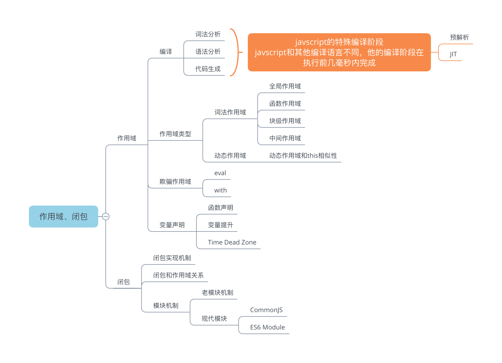
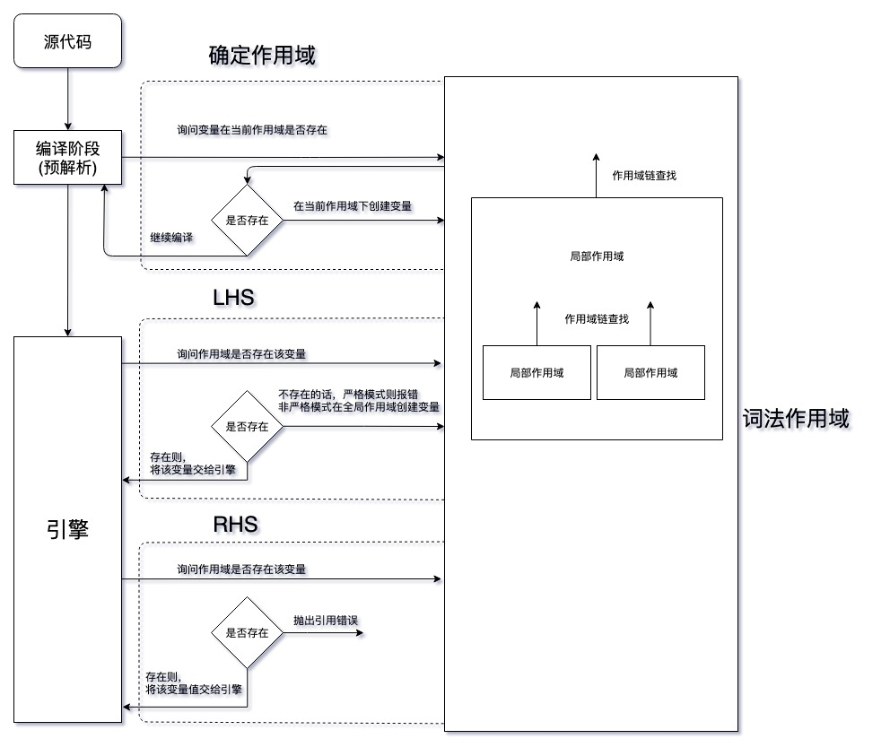
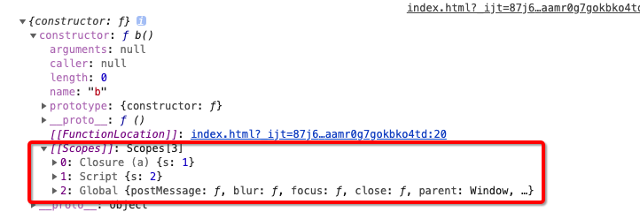

# 你不知道的 Javascript 作用域和闭包



## 作用域

作用域：负责收集和维护声明标识符组成的一些列查询，并根据严苛的规则，确定当期执行代码对标识符的访问权限的程序。

### 作用域简介

作用域一般分为 `动态作用域` 和 `词法作用域`，**javascript 作用域为词法作用域**, 所以 javascript 的作用域在书写代码时已经决定了，当然 javascript 还有欺骗词法作用域的手段(如 width eval)

词法作用域: 在`词法解析`时就已经决定了作用域，即决定性因素在书写嵌套，后续一般不会改变(但是存在特殊情况，例如`欺骗作用域`)

词法解析存在于编译阶段，编译阶段一般分为 3 个步骤：

1. _词法解析_: 将源代码解析为`词法单元流`,是由`词法单元组成的数组`。词法解析一般还包含对单词的检查、优化等,如果是有状态的解析，则会赋予单词意义(例如 javascript 函数声明 )；
2. _语法解析_: 将词法单元流转换为抽象语法树(AST)；
3. _代码生成_：将 AST 转换为可执行代码；

但 javascript 与其他编译型语言不同，它编译不是在构建当中，而是在执行前几毫秒内完成编译及优化；

在 javascript 中，作用域主要承担两个职责：

- 收集并维护声明标识符、查询标识符
- 根据严格规则，定义标识符的作用范围(`最小控制原则`)

在编译阶段和执行阶段，编译器和引擎会和作用域产生交互，交流流程图如下：



举个简单的例子，按照如下示例代码解释流程

```
var a = 2;
var a = 3;
var b = a;
```

在编译阶段，编译器会预解析声明语句：

- 编译器->作用域：当前作用域下是否存在 a 变量；
- 作用域->编译器：不存在，我创建一个变量 a;
- ... 编译器继续编译 ...；
- 编译器->作用域：当前作用域下是否存在 a 变量；
- 作用域->编译器：存在了；
- ... 编译器继续编译 ...；
- 编译器->作用域：当前作用域下是否存在 b 变量；
- 作用域->编译器：不存在，我创建一个变量 b;

**如果是函数声明语句，编译器还会处理函数声明值；而对于其他声明，则只处理变量**

该阶段后，作用域建立完成，进入代码执行阶段，由引擎执行

在引擎执行阶段：

LHS

- 引擎->作用域：你有 a 这个变量吗
- 作用域->引擎：有啊，给你 a
- 引擎将 a 赋值为 2

LHS

- 引擎->作用域：你有 a 这个变量吗
- 作用域->引擎：有啊，给你 a
- 引擎将 a 赋值为 3

RHS

- 引擎->作用域：你知道 a 的值吗？；
- 作用域->引擎：知道啊，他的值是 3；

LHS

- 引擎->作用域：你有 b 这个变量吗
- 作用域->引擎：有啊，给你 b
- 引擎将 b 赋值为 3

### 作用域类型

#### 全局作用域

全局作用域在整个运行环境中，只存在一个，浏览器为 window,node 为 global。任何其他作用域都包裹在全局作用域下；

#### 函数作用域

函数作用域为局部作用域一种，存在于函数内

#### 块级作用域

在 ES6 中，出现的新的作用域，该作用域出现的两个条件：

- 变量由 let const 声明
- 由大括号包裹

#### 中间作用域

在 ES 中，出现的新的作用域，该作用域出现的两个条件：

- 函数有参数
- 参数有默认值

### 变量提升

在作用域内，将变量声明和函数声明提到顶部；

#### 变量声明 vs 函数声明

函数声明 的变量提升优先于 变量声明，且函数声明在编译阶段就会处理值，所以 LHS 模型不适用于函数声明

#### var vs let 和 const

var 和 let const 都会导致变量提升，这是 javascript 的特性；但是由 let/const 声明的变量存在`time dead zone`,在声明前使用是会抛错的；  
变量声明分为两步：创建变量、词法绑定。由 var 声明时创建变量、词法绑定同时完成；而 let/const 声明的变量在编译阶段只是创建变量，并未进行词法绑定，词法绑定在赋值语句完成, 所以在使用时会抛出错误

### 欺骗作用域

~~不建议使用~~

```
width(xx){}
eval(xx)
```

width：将对象处理为词法作用域，在严格模式下禁止使用  
eval: 插入当前作用域，严格模式下创建新的作用域

width 和 eval 存在性能问题，因为引擎在编译阶段会进行优化，其中某些优化需要静态分析，预先确定函数、变量的位置才能完成。而 with 和 eval 都无法静态分析确认

### 概念介绍

动态作用域：在运行时决定作用域，即动态作用域决定性因素在调用栈，而词法作用域决定因素在书写嵌套；  
词法单元: 将语句解析为有意义的单词，如 var a = 2;解析后为 \[ var, a, =, 2, ; \](伪代码)；  
LHS: left-hand-side，赋值操作左侧，指向谁赋值，简单理解为等号左边；  
RHS: right-handle-side,赋值操作右侧，指取谁的值，简单理解为等号右边；  
最小控制原则: 最小限度暴露必要内容，隐藏其他内容

## 闭包

闭包：在当前词法作用域之外执行时，也可以访问到定义时的词法作用域的行为。  
闭包时基于词法作用域书写代码的必然结果

### 基于函数作用域来描述 作用域和闭包

```
const s = 1;
function a(){
  const s = 2;

  function b(){
    const s_b = s;
  }
  console.log(b.prototype);
}
a();
```

Google 浏览器 --> F12 --> Console --> 展开 constructor


函数在创建时，会沿着作用域链查找自身作用域不存在的变量，例如 s 变量，查找到变量后会将存入 [[Scope]]属性中。当需要使用该变量时，会沿着[[Scope]]数组查找，顺序为数组下标升序，如果查找到后，则停止查找，否则直到 Global 作用域，
如果 Global 也不能找到，则会抛错。

<!-- 所以作用域查找行为，即是沿着[[Scope]]数组查找的行为(仅是指代码执行阶段)，~~对于编译阶段如何确定作用域链未知~~
闭包，也是从[[Scope]]获取属性的行为 -->
